# Fantasy SGP System - Technical Documentation

---

## Table of Contents

1. [Introduction](#introduction)
2. [Executive Summary](#executive-summary)
3. [System Architecture](#system-architecture)
4. [Core Concepts & Mathematical Foundation](#core-concepts--mathematical-foundation)
5. [Component Deep Dive](#component-deep-dive)
6. [Data Flow & Processing Pipeline](#data-flow--processing-pipeline)
7. [Deployment Architecture](#deployment-architecture)
8. [API & Integration Points](#api--integration-points)
9. [Configuration Management](#configuration-management)
10. [Maintenance & Operations](#maintenance--operations)
11. [Troubleshooting Guide](#troubleshooting-guide)

---

## Introduction

The Fantasy SGP System is a comprehensive project that was born as an excel workbook with an absurd amount of sheets used to inform my Fantasy Baseball drafting strategy, and has evolved into the Full-Stack application presented here. It involves a web-scraping and data processing python backend, Docker containers deployed using GCP, and finally, the streamlit web application to display all the necessary information for informing decisions such as pre-season draft rankings, in-season player rankings, and rest of season valuations. The motivation for this was born out of the original [Standings Gain Points](https://www.smartfantasybaseball.com/2013/03/create-your-own-fantasy-baseball-rankings-part-5-understanding-standings-gain-points/) system, which is used commonly by fantasy baseball practicioners playing in a [ROTO](https://www.rotoballer.com/how-to-play-fantasy-baseball-roto-rotisserie-leagues-overview/1137359) format. The premise behind ROTO is teams are awarded points based off where they place in the standings in each category independently, where points for a specified category are awarded on a scale of $\text{ROTO}_c \in [1,\text{number of teams}]$ in reverse order of standings, and then summed up to obtain the team's total score:

$$
\text{team score} = \sum_{c=1}^{\text{number of categories}} \text{ROTO}_c 
$$

For example, in a 12 team league, the team that is first in home runs will be awarded 12 points for that category, while the last place team in home runs will be awarded 1. Assuming a 10 category league (standard), the maximum a team could, therefore, earn is 120 points by placing in first in every category, and oppositedly the minimum would be 10, if a team placed last in every category.

The traditional Standings Gain Points (SGP) model uses this scoring framework and attempts to assign value at the player level for how many places in the standings their production will provide. It does this by using the specific league's history, and calculating an average stat across previous seasons for each place in the standings, and it does so for every category. The result then is the average differential across adjacent places in the standings within each category can be calculated, and is then used to calculate the amount needed to earn 1 SGP. For example, if it is calculated that the average differential amongst all the standing places in Home Runs is 10, then a player projected for 20 Home Runs will earn 2 SGP for that category. Once again, this is repeated for all categories and then all of the results are summed to provide a total SGP for each player. While this system benefits from its simplicity, and intuitive nature, there are however, some mathematical flaws and inconsistencies.

The calculation for a player's SGP in a given category can be simply expressed as: $\text{SGP}_c^p = \frac{\text{stat}_c^p}{\delta_c}$ (Note: this applies to counting categories as rate stats are more involved and are discussed later.) As is easily apparent, is it impossible for a player to contribute negative value with the current method. That is to say, there is no minimum threshold required before a player starts contributing standings points in a given category. Upon review of how roto points are calculated, it can be shown that the total amount of ROTO points in a given league across all teams should be:

$$
{\text{League ROTO}} = n_c \sum_{i=1}^{n_{\text{teams}}} i
$$

where $n_c$ is number of categories, and $n_{\text{teams}}$ is the number of teams in the league. In a league that employs 6 hitting categories, with 12 teams, the total number of ROTO points for hitting alone would then be 432, or 72 per category. In order to translate this to our SGP scoring system, we would need to remove the baseline being awarded 1 point, which for the same parameters just mentioned would mean 66 per category, and therefore, 396 Hitting SGPs across the rostered universe of players. However, using ATC pre-season projections for the 156 highest valued players (this specific league has 13 hitter slots multiplied by the 12 teams), the pre-season SGP calculations from the traditional model just presented would result in the following:

| R SGP  | RBI SGP | HR SGP | SB SGP | OBP SGP | SLUG SGP | SUM      |
|-------:|--------:|-------:|-------:|--------:|---------:|---------:|
| 737.08 | 722.65  | 461.85 | 148.71 | 2.17    | 21.51    | 2093.96  |

To say this is quite a bit of a delta would be an understatement. What's even more interesting and actually quite intuitive is the fact that the OBP and SLUG scores are relatively much smaller than their counterparts, and this is due to the traditional calculation being taken against the league historical average; in a theoretical framework, where the projections were anticipating an average run environment compared to recent seasons, and the league rostered the optimal set of players, these rate SGPs would ideally be zero. At this point, one could observe these values and dismiss the model altogether as mathematically void, and use something such as Z-score sums, etc. The problem, however, isn't the idea behind this system, its the execution.

In the traditional model, it neglects the fact that in order to actually start earning Standings Gain Points, a player has to exceed a certain threshold determined by the worst place team's value in a given category. For instance, if all 13 hitters hit 10 home runs each in a given season, the team total would obviously be 130 home runs. Under the model presented, each of these players would earn $\frac{10}{7.28} = 1.37, \qquad \delta_{\text{HR}} = 7.28$. Summing this up across all 13 players would result in ~17.8 SGPs for the team in terms of home runs. This would imply they're projected to be first in the league in home runs! The reality is though, that the average 12th place team has hit 226 home runs in my league historically, a whopping 96 more than what the theoretical team with 17 SGPs is projected to hit. Here in lies the motivation and foundation for my new and improved model.

In order to properly assess where the team from the 130 home runs example stands, we need to compare it to what the league's baseline is to actually make gains in the standings. Given that the baseline is 226 in the case of home runs, that means on average the worst place team's average player hit ~17 home runs (the actual number is slightly more than 18, found using a best fit line across the league data points, and removing the extreme values, which will be explained in further detail later). Therefore, if every hitter on the roster is projected for 17 home runs, this team will be the last place team in the category and will have gained ZERO places in the standings. Now lets say one player is projected for 25 home runs while the remaining are still projected for that 17 number. Since the $\delta_{\text{HR}} = 7.28$, this player would receive right above 1 SGP for home runs, and it is intuitive that the team cumulative would now gain them a place in the standings if the 11th place team is only 7 home runs above the last place team. At last, the team total SGP, which would be the 1+ SGP gained from the player hitting 25 home runs in additional to all the net neutral 17 home run hitters, actually matches their placement in the standings.

All it took to better align player's contribution to the team's place in the standings is creating a threshold for each category before a player starts accumulating positive value. What this also achieves is it essentially normalizes the categories for cross comparison amongst one another, as some categories will have much higher thresholds. For the rate stats, the main difference between this model and the traditional is that rather than compare the player's projection/stat to the league's average, it once again compares the player against the baseline rate, to evaluate how many places in the standings the player's contribution gains the overall team average. In a later section there is equations and detailed descriptions of variables in order to fully encompass the methodology.

The following section presents a preview of the streamlit app's interface, and how the SGP processed leaderboards, along with projections and up to date stats, are presented to the user.

---

## Executive Summary

### What is the Fantasy SGP System?

The Fantasy SGP (Standings Gain Points) System is a full-stack application designed to provide advanced fantasy baseball analytics. It transforms player projections and historical league data into actionable insights for draft strategy, in-season player rankings, and rest-of-season valuations catered to your league's settings and players' tendencies.

### Problem Statement

Traditional SGP models assign value to players based on raw statistics without accounting for:
- **Replacement level thresholds**: Players must exceed the worst team's average production to contribute positive value
- **Rate stat calculations**: Traditional methods compare to league averages rather than baseline teams
- **Cross-category normalization**: Different statistics scales make direct comparisons difficult

### Solution Architecture

The system implements an improved SGP calculation methodology that:
1. **Establishes replacement levels** from historical league standings
2. **Normalizes across categories** using standard deviations
3. **Accounts for time remaining** in the season via week factors
4. **Processes both counting and rate statistics** with distinct algorithms
5. **Delivers insights** through a cloud-deployed Streamlit web application

### Key Technologies

- **Backend**: Python 3.12, Pandas, NumPy, Selenium
- **Frontend**: Streamlit (Python-based web framework)
- **Data Storage**: Google Cloud Storage (GCS)
- **Orchestration**: Docker, Google Cloud Run
- **Data Sources**: FanGraphs (projections & statistics)

### Streamlit Application Preview

The Fantasy SGP System delivers its insights through an intuitive Streamlit web application. The following screenshots demonstrate the key features:

#### Up-To-Date Stats Dashboard

The leaderboard displays real-time player season-to-date statistics


**Key Features:**
- Player names with position eligibility
- Category-specific SGP breakdowns (R, RBI, HR, SB, OBP, SLG)
- Total SGP rankings for quick value assessment
- Sortable columns for flexible analysis
- Real-time data updates from FanGraphs

#### Rest of Season SGP Projections Example

The ROS (Rest-of-Season) view provides forward-looking projections to inform trade decisions and lineup optimization:


**Key Features:**
- Projected SGP values for remaining season games
- Weighted by weeks remaining in the season
- Accounts for player trends and projection system updates
- Helps identify buy-low and sell-high opportunities
- Supports both hitter and pitcher analysis

**Access the Live Application:**
- Latest Version: https://sgp-viewer-110810475909.us-central1.run.app/

---

## System Architecture

### High-Level Architecture

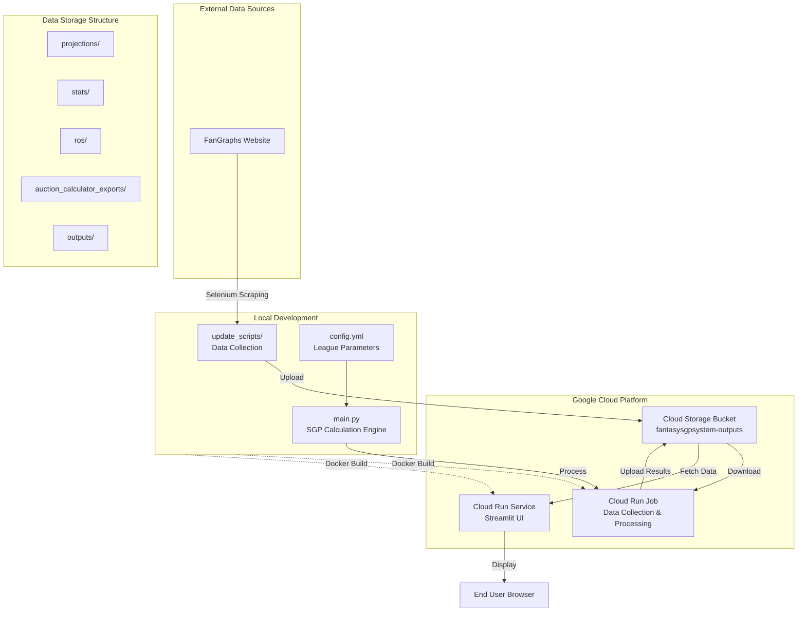
```mermaid
flowchart TB
    subgraph External["External Data Sources"]
        FG[FanGraphs Website]
    end
    
    subgraph GCP["Google Cloud Platform"]
        GCS[Cloud Storage Bucket<br/>fantasysgpsystem-outputs]
        GCR_Job[Cloud Run Job<br/>Data Collection & Processing]
        GCR_UI[Cloud Run Service<br/>Streamlit UI]
    end
    
    subgraph Local["Local Development"]
        Main[main.py<br/>SGP Calculation Engine]
        UpdateScripts[update_scripts/<br/>Data Collection]
        Config[config.yml<br/>League Parameters]
    end
    
    subgraph Storage["Data Storage Structure"]
        Proj[projections/]
        Stats[stats/]
        ROS[ros/]
        AucCalc[auction_calculator_exports/]
        Outputs[outputs/]
    end
    
    FG -->|Selenium Scraping| UpdateScripts
    UpdateScripts -->|Upload| GCS
    GCS -->|Download| GCR_Job
    Config --> Main
    Main -->|Process| GCR_Job
    GCR_Job -->|Upload Results| GCS
    GCS -->|Fetch Data| GCR_UI
    GCR_UI -->|Display| User[End User Browser]
    
    Local -.->|Docker Build| GCR_Job
    Local -.->|Docker Build| GCR_UI
```

### Component Architecture

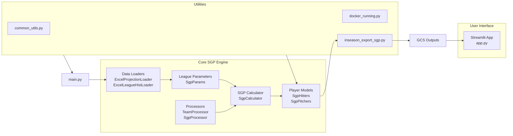
```mermaid
flowchart LR
    subgraph Core["Core SGP Engine"]
        direction TB
        Loaders[Data Loaders<br/>ExcelProjectionLoader<br/>ExcelLeagueHistLoader]
        Params[League Parameters<br/>SgpParams]
        Calc[SGP Calculator<br/>SgpCalculator]
        Proc[Processors<br/>TeamProcessor<br/>SgpProcessor]
        Models[Player Models<br/>SgpHitters<br/>SgpPitchers]
    end
    
    subgraph Utils["Utilities"]
        Common[common_utils.py]
        Docker[docker_running.py]
        Export[inseason_export_sgp.py]
    end
    
    subgraph UI["User Interface"]
        Streamlit[Streamlit App<br/>app.py]
    end
    
    Main[main.py] --> Loaders
    Loaders --> Params
    Params --> Calc
    Proc --> Calc
    Calc --> Models
    Models --> Export
    Export --> GCS_Out[GCS Outputs]
    
    Utils --> Main
    Utils --> Models
    
    GCS_Out --> Streamlit
```

### Execution Modes

The system operates in three distinct modes based on the season timeline:

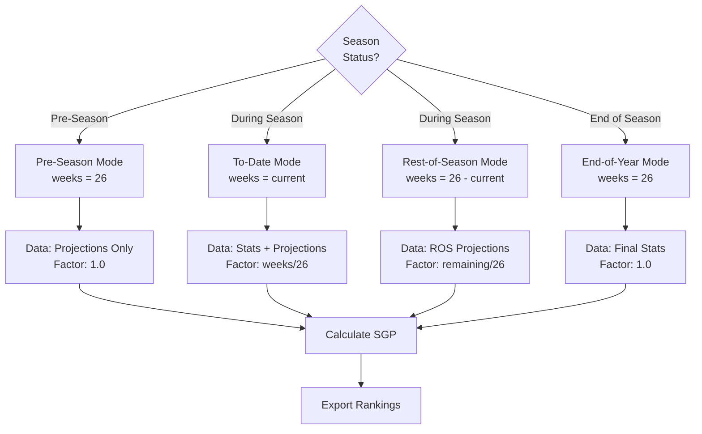
```mermaid
flowchart TD
    Start{Season<br/>Status?}
    
    Start -->|Pre-Season| PreMode[Pre-Season Mode<br/>weeks = 26]
    Start -->|During Season| TDMode[To-Date Mode<br/>weeks = current]
    Start -->|During Season| ROSMode[Rest-of-Season Mode<br/>weeks = 26 - current]
    Start -->|End of Season| EOYMode[End-of-Year Mode<br/>weeks = 26]
    
    PreMode --> PreData[Data: Projections Only<br/>Factor: 1.0]
    TDMode --> TDData[Data: Stats + Projections<br/>Factor: weeks/26]
    ROSMode --> ROSData[Data: ROS Projections<br/>Factor: remaining/26]
    EOYMode --> EOYData[Data: Final Stats<br/>Factor: 1.0]
    
    PreData --> Calculate[Calculate SGP]
    TDData --> Calculate
    ROSData --> Calculate
    EOYData --> Calculate
    
    Calculate --> Output[Export Rankings]
```

---

## Core Concepts & Mathematical Foundation

### The Problem with Traditional SGP

Traditional SGP assigns value using the formula:

$$
\text{SGP}_{\text{traditional}} = \frac{\text{player stat}}{\text{average difference between standings}}
$$

**Critical Flaw**: A player projected for 10 HR receives positive SGP even if the worst team averages 17 HR per player. This player would **hurt** your team's standings, not help.

### Improved SGP Methodology

#### Week Factor Normalization

The system accounts for time progression using a week factor:

$$
f = \begin{cases}
\frac{w}{26} & \text{for season-to-date} \\
\frac{26-w}{26} & \text{for rest-of-season} \\
1 & \text{for pre-season}
\end{cases}
$$

Where $w$ is weeks completed in the 26-week season.

#### Counting Statistics (R, HR, RBI, SB, QS, SV+H, SO)

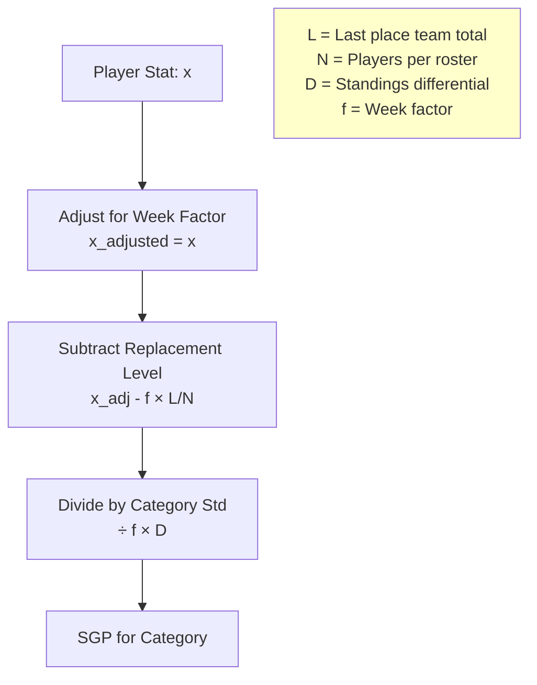
```mermaid
flowchart TD
    Start[Player Stat: x] --> Adjust[Adjust for Week Factor<br/>x_adjusted = x]
    Adjust --> Baseline[Subtract Replacement Level<br/>x_adj - f × L/N]
    Baseline --> Normalize[Divide by Category Std<br/>÷ f × D]
    Normalize --> SGP[SGP for Category]
    
    Note1[L = Last place team total<br/>N = Players per roster<br/>D = Standings differential<br/>f = Week factor]
    
    style Note1 fill:#ffffcc
```

**Formula:**

$$
\text{SGP}_c = \frac{x_c^{(p)} - f \cdot \frac{L_c^{\text{team}}}{N^{\text{players}}}}{f \cdot D_c}
$$

**Variables:**
- $x_c^{(p)}$ = Player's stat in category $c$
- $L_c^{\text{team}}$ = Worst team's season total
- $N^{\text{players}}$ = Roster slots (13 hitters, 9 pitchers)
- $D_c$ = Average difference between standings positions
- $f$ = Week factor

#### Rate Statistics (AVG, OBP, SLG, ERA, WHIP, K/BB)

Rate stats require more complex calculations because we must model how a player changes team averages:

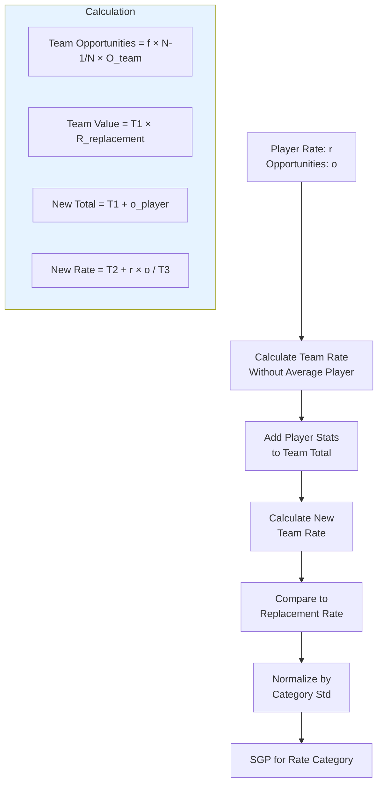
```mermaid
flowchart TD
    Start[Player Rate: r<br/>Opportunities: o] --> TeamCalc[Calculate Team Rate<br/>Without Average Player]
    TeamCalc --> AddPlayer[Add Player Stats<br/>to Team Total]
    AddPlayer --> NewRate[Calculate New<br/>Team Rate]
    NewRate --> Compare[Compare to<br/>Replacement Rate]
    Compare --> Normalize[Normalize by<br/>Category Std]
    Normalize --> SGP[SGP for Rate Category]
    
    subgraph Calculation
        T1[Team Opportunities = f × N-1/N × O_team]
        T2[Team Value = T1 × R_replacement]
        T3[New Total = T1 + o_player]
        T4[New Rate = T2 + r × o / T3]
    end
    
    style Calculation fill:#e6f3ff
```

**Formula:**

$$
\text{SGP}_c = \frac{\dfrac{f \cdot R_c^{\text{team}} \cdot \frac{N-1}{N} \cdot O_c^{\text{team}} + r_c^{(p)} \cdot o_c^{(p)}}{f \cdot \frac{N-1}{N} \cdot O_c^{\text{team}} + o_c^{(p)}} - R_c^{\text{team}}}{D_c}
$$

**Variables:**
- $r_c^{(p)}$ = Player's rate (e.g., OBP = 0.350)
- $o_c^{(p)}$ = Player's opportunities (e.g., PA = 600)
- $R_c^{\text{team}}$ = Replacement team's rate
- $O_c^{\text{team}}$ = Average team opportunities
- $N$ = Players on roster

**Intuition**: This models "if we replace one average worst-place player with this player, how much does the team rate improve?"

### Replacement Level & Value Above Replacement

After calculating raw SGP, the system determines:

1. **Replacement Level** (RL): The SGP of the last player who would be rostered in the league
2. **Value Above Replacement** (VAR): `SGP - RL`

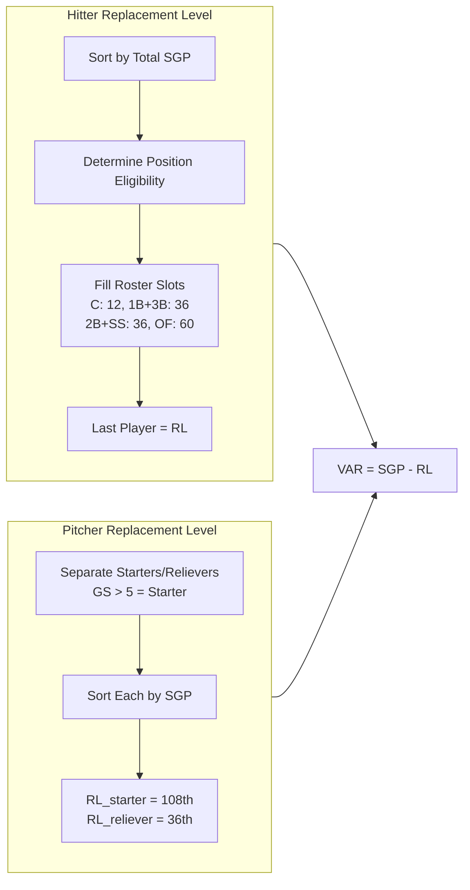
```mermaid
flowchart LR
    subgraph Hitters["Hitter Replacement Level"]
        H1[Sort by Total SGP]
        H2[Determine Position Eligibility]
        H3[Fill Roster Slots<br/>C: 12, 1B+3B: 36<br/>2B+SS: 36, OF: 60]
        H4[Last Player = RL]
        H1 --> H2 --> H3 --> H4
    end
    
    subgraph Pitchers["Pitcher Replacement Level"]
        P1[Separate Starters/Relievers<br/>GS > 5 = Starter]
        P2[Sort Each by SGP]
        P3[RL_starter = 108th<br/>RL_reliever = 36th]
        P1 --> P2 --> P3
    end
    
    Hitters --> VAR[VAR = SGP - RL]
    Pitchers --> VAR
```

---

## Component Deep Dive

### 1. Data Collection (`update_scripts/update_stats.py`)

#### Purpose
Automates web scraping of FanGraphs projection systems and current season statistics using Selenium.

#### Scraping Flow

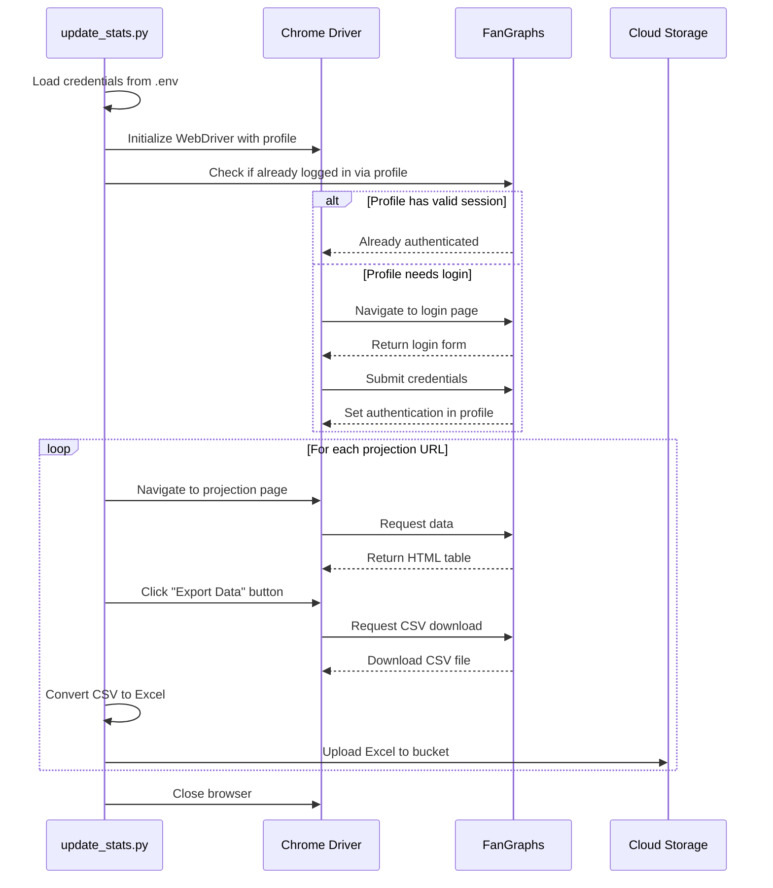
```mermaid
sequenceDiagram
    participant Script as update_stats.py
    participant Chrome as Chrome Driver
    participant FG as FanGraphs
    participant GCS as Cloud Storage
    
    Script->>Script: Load credentials from .env
    Script->>Chrome: Initialize WebDriver with profile
    Script->>FG: Check if already logged in via profile
    
    alt Profile has valid session
        FG-->>Chrome: Already authenticated
    else Profile needs login
        Chrome->>FG: Navigate to login page
        FG-->>Chrome: Return login form
        Chrome->>FG: Submit credentials
        FG-->>Chrome: Set authentication in profile
    end
    
    loop For each projection URL
        Script->>Chrome: Navigate to projection page
        Chrome->>FG: Request data
        FG-->>Chrome: Return HTML table
        Script->>Chrome: Click "Export Data" button
        Chrome->>FG: Request CSV download
        FG-->>Chrome: Download CSV file
        Script->>Script: Convert CSV to Excel
        Script->>GCS: Upload Excel to bucket
    end
    
    Script->>Chrome: Close browser
```

#### Key Features

**Chrome Profile Management:**
```python
# Docker environment - persistent profile directory
if is_running_in_docker():
    options.add_argument("--user-data-dir=/chrome_profile")
    options.add_argument("--headless=new")
else:
    # Local development - local profile directory
    profile_path = Path("./chrome_profile").resolve()
    options.add_argument(f"--user-data-dir={profile_path}")
```

**Docker/Selenium Grid Support:**
```python
if is_running_in_docker():
    options.add_argument("--headless")
    driver = webdriver.Remote(
        command_executor=SELENIUM_GRID_URL,
        options=options
    )
```

**Data Sources Scraped:**
- `fangraphs_hitting_stats`: Current season hitting statistics
- `fangraphs_pitching_stats`: Current season pitching statistics
- `auc_calc_hitting_*`: Auction calculator projections (for playing time)
- `auc_calc_pitching_*`: Pitcher auction projections

### 2. Data Loaders (`Sgp/loaders/`)

#### ExcelProjectionLoader

Loads player projections based on time period (pre-season, to-date, rest-of-season, end-of-year).

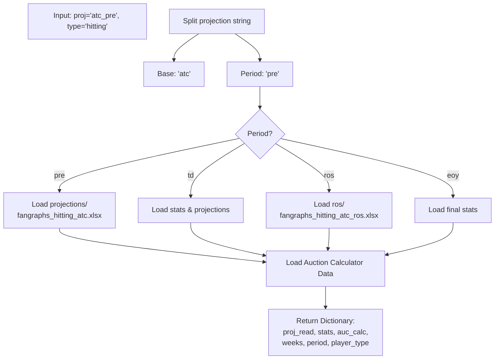
```mermaid
flowchart TD
    Input[Input: proj='atc_pre', type='hitting']
    Split[Split projection string]
    Split --> Base[Base: 'atc']
    Split --> Period[Period: 'pre']
    
    Period --> PreCheck{Period?}
    PreCheck -->|pre| PreLoad[Load projections/<br/>fangraphs_hitting_atc.xlsx]
    PreCheck -->|td| TDLoad[Load stats & projections]
    PreCheck -->|ros| ROSLoad[Load ros/<br/>fangraphs_hitting_atc_ros.xlsx]
    PreCheck -->|eoy| EOYLoad[Load final stats]
    
    PreLoad --> AucCalc[Load Auction Calculator Data]
    TDLoad --> AucCalc
    ROSLoad --> AucCalc
    EOYLoad --> AucCalc
    
    AucCalc --> Dict[Return Dictionary:<br/>proj_read, stats, auc_calc,<br/>weeks, period, player_type]
```

**Return Structure:**
```python
{
    'proj_read': DataFrame,     # Projection data
    'stats': DataFrame,         # Actual statistics
    'auc_calc': DataFrame,      # Playing time expectations
    'weeks': int,               # Weeks for calculations
    'period': str,              # 'pre', 'td', 'ros', 'eoy'
    'player_type': str,         # 'hitting' or 'pitching'
    'projection': str,          # 'atc', 'batx', etc.
    'ip_adj': str               # Optional IP adjustment
}
```

#### ExcelLeagueHistLoader

Loads historical league standings data to calculate replacement levels and standard deviations.

**Excel Format Expected:**
```
| Category | Replacement | Std  |
|----------|-------------|------|
| R        | 17.2        | 7.8  |
| HR       | 18.4        | 7.28 |
| RBI      | 16.9        | 8.1  |
| ...      | ...         | ...  |
```

**Output:**
```python
{
    'R': (17.2, 7.8),      # (replacement_level, std_dev)
    'HR': (18.4, 7.28),
    'RBI': (16.9, 8.1),
    # ... all categories
}
```

### 3. Parameter Management (`Sgp/params/SgpParams.py`)

Centralizes league-specific parameters and category definitions.

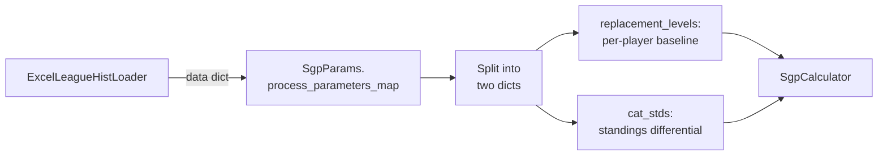
```mermaid
flowchart LR
    Loader[ExcelLeagueHistLoader] -->|data dict| Process[SgpParams.<br/>process_parameters_map]
    Process --> Split[Split into<br/>two dicts]
    Split --> Repl[replacement_levels:<br/>per-player baseline]
    Split --> Stds[cat_stds:<br/>standings differential]
    
    Repl --> Calculator[SgpCalculator]
    Stds --> Calculator
```

**Usage Pattern:**
```python
params = SgpParams()
params.process_parameters_map(loader.data)
# Now params.replacement_levels and params.cat_stds are populated
```

### 4. Team Processing (`Sgp/processor/TeamProcessor.py`)

Calculates average team values and opportunities for rate stat calculations.

#### Hitter Processing Flow

```mermaid
flowchart TD
    Start[TeamProcessor Init<br/>with hitting data]
    Start --> Config[Load config.yml<br/>Extract categories]
    Config --> NumPlayers[Calculate league size<br/>12 teams × 13 hitters = 156]
    NumPlayers --> Loop[For each rate category]
    
    Loop --> CalcOpp[Calculate Avg Opportunities<br/>avg_PA = mean of top 156]
    CalcOpp --> TeamOpp[Team Opps Without Replacement<br/>= avg_PA × 12 hitters]
    TeamOpp --> TeamVal[Team Value Without Replacement<br/>= team_opps × replacement_rate]
    
    TeamVal --> Store[Store in dictionaries:<br/>team_opportunities[stat]<br/>team_value[(cat, opp)]]
    
    Store --> Done[Pass to SgpCalculator]
```

**Example for OBP:**
```python
# Average PA for top 156 hitters = 550
avg_PA = 550

# Team PA without one player (12 hitters)
team_opps = 550 × 12 = 6600

# If replacement OBP = 0.310
team_value = 6600 × 0.310 = 2046
```

#### Pitcher Processing

Similar logic but with two distinct pools:
- **Starters**: 9 per team (108 league-wide)
- **Relievers**: 3 per team (36 league-wide)

**IP Adjustment Feature:**
When projections have unrealistic playing time, can substitute IP from another projection system:

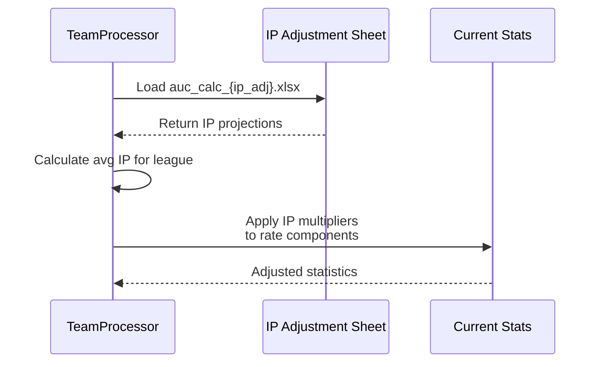
```mermaid
sequenceDiagram
    participant Proc as TeamProcessor
    participant IPAdj as IP Adjustment Sheet
    participant Stats as Current Stats
    
    Proc->>IPAdj: Load auc_calc_{ip_adj}.xlsx
    IPAdj-->>Proc: Return IP projections
    Proc->>Proc: Calculate avg IP for league
    Proc->>Stats: Apply IP multipliers<br/>to rate components
    Stats-->>Proc: Adjusted statistics
```

### 5. SGP Calculator (`Sgp/calc/SgpCalculator.py`)

Core calculation engine implementing the mathematical formulas.

#### Counting Stats Method

```python
def cat_calc_sgp(self, categories: List[str]):
    factor = self.weeks / 26
    replacement = pd.Series(self.replacement_levels).reindex(categories)
    stds = pd.Series(self.cat_stds).reindex(categories)
    
    # Formula: (stat - f*repl) / (f*std)
    sgp = self.stats[categories].sub(factor*replacement, axis=1) \
                                .div(factor*stds, axis=1)
    
    sgp.columns = [f'SGP_{cat}' for cat in categories]
    return sgp
```

#### Rate Stats Method (Hitting)

```python
def rate_calc_sgp(self, categories: List[tuple]):
    factor = self.weeks / 26
    result = {}
    
    for cat, opp in categories:  # e.g., ('OBP', 'PA_SH')
        # Team total without average player
        team_val = factor * self.team_value[(cat, opp)]
        team_opp = factor * self.team_opportunities[opp]
        
        # Add player to team
        new_numerator = team_val + self.stats[cat] * self.stats[opp]
        new_denominator = team_opp + self.stats[opp]
        
        # Calculate new team rate
        new_rate = new_numerator / new_denominator
        
        # Compare to replacement
        sgp = (new_rate - self.replacement_levels[cat]) / self.cat_stds[cat]
        result[f'SGP_{cat}'] = sgp
    
    return pd.DataFrame(result)
```

### 6. Player Models (`Sgp/SgpHitters.py` & `Sgp/SgpPitchers.py`)

Orchestrate the calculation flow for each player type.

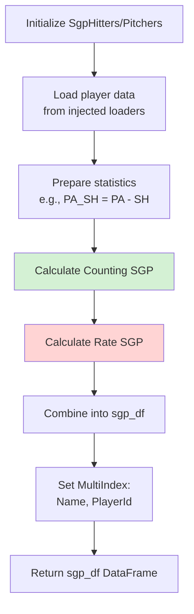
```mermaid
flowchart TD
    Init[Initialize SgpHitters/Pitchers] --> LoadData[Load player data<br/>from injected loaders]
    LoadData --> Prep[Prepare statistics<br/>e.g., PA_SH = PA - SH]
    Prep --> CountSGP[Calculate Counting SGP]
    CountSGP --> RateSGP[Calculate Rate SGP]
    RateSGP --> Combine[Combine into sgp_df]
    Combine --> Index[Set MultiIndex:<br/>Name, PlayerId]
    Index --> Return[Return sgp_df DataFrame]
    
    style CountSGP fill:#d4f1d4
    style RateSGP fill:#ffd4d4
```

**Output DataFrame Structure:**
```
                           SGP_R  SGP_HR  SGP_RBI  SGP_SB  SGP_OBP  SGP_SLG
Name            PlayerId                                                     
Aaron Judge     12345      8.2    12.5    10.1     -0.3     4.2      8.7
Mookie Betts    67890      9.1    8.3     7.9      2.1      5.1      7.2
...
```

### 7. SGP Processor (`Sgp/processor/SgpProcessor.py`)

Combines hitter and pitcher results, determines position eligibility, and calculates VAR.

#### Position Assignment Algorithm

The position assignment algorithm operates in two distinct phases to determine player value above replacement (VAR).

##### Phase 1: Build Rostered Universe (156 Total Players)

**Roster Requirements (12 Teams):**

Each team has: **C, 1B, 2B, 3B, SS, MI, CI, 5×OF, UTIL** = 13 hitters

League-wide minimum requirements:
```python
# Individual position minimums (1 per team)
min_position_counts = {
    "C": 12,      # 12 catchers
    "1B": 12,     # 12 first basemen
    "2B": 12,     # 12 second basemen  
    "3B": 12,     # 12 third basemen
    "SS": 12,     # 12 shortstops
    "OF": 60      # 60 Outfielders
}

# Combined bucket requirements
self.sufficient_pos_counts = {
    "C": 12,      # 12 catchers (1 per team)
    "CI": 36,     # 36 corner infielders (1B + 3B: 3 per team)
    "MI": 36,     # 36 middle infielders (2B + SS: 3 per team)
    "OF": 60,     # 60 outfielders (5 per team)
    "UTIL": 12    # 12 utility slots (1 per team)
}
# Total: 156 rostered hitters

# Example CI breakdown: Could be 12 1B + 24 3B, or 18 1B + 18 3B, or 20 1B + 16 3B
# As long as: (1B count >= 12) AND (3B count >= 12) AND (1B + 3B = 36)
# Same logic for MI: (2B >= 12) AND (SS >= 12) AND (2B + SS = 36)
```

### PHASE 1: Determine Rosterable Universe and Assign Player Positions and Buckets:
1. Sort all hitters by **Total_SGP descending** (highest value players first)
2. Get position eligibility from **auction calculator data** (e.g., "SS/OF", "C/1B")

Players are then assigned by determining their **primary position** first, then checking for alternative assignments:

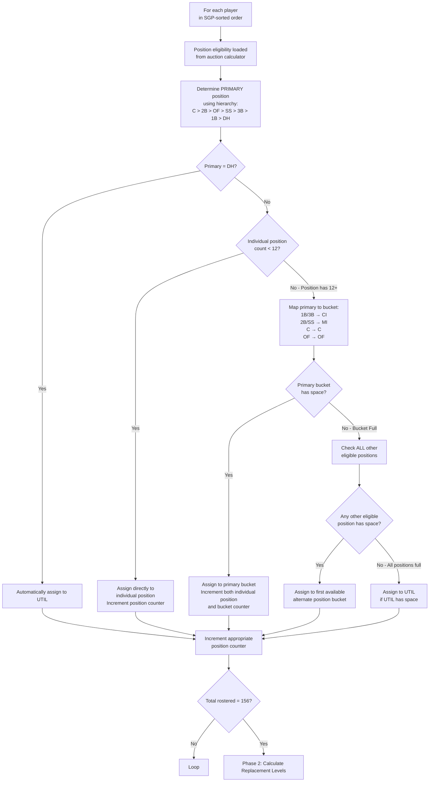
```mermaid
flowchart TD
    Start[For each player<br/>in SGP-sorted order] --> GetElig[Position eligibility loaded<br/>from auction calculator]
    
    GetElig --> Primary[Determine PRIMARY position<br/>using hierarchy:<br/>C > 2B > OF > SS > 3B > 1B > DH]
    
    Primary --> IsDH{Primary = DH?}
    IsDH -->|Yes| AssignUTIL[Automatically assign to UTIL]
    
    IsDH -->|No| CheckMinimum{Individual position<br/>count < 12?}
    
    CheckMinimum -->|Yes| AssignDirect[Assign directly to<br/>individual position<br/>Increment position counter]
    
    CheckMinimum -->|No - Position has 12+| MapPos[Map primary to bucket:<br/>1B/3B → CI<br/>2B/SS → MI<br/>C → C<br/>OF → OF]
    
    MapPos --> CheckBucket{Primary bucket<br/>has space?}
    
    CheckBucket -->|Yes| AssignPrimary[Assign to primary bucket<br/>Increment both individual position<br/>and bucket counter]
    
    CheckBucket -->|No - Bucket Full| CheckOthers[Check ALL other<br/>eligible positions]
    
    CheckOthers --> OtherAvail{Any other eligible<br/>position has space?}
    
    OtherAvail -->|Yes| AssignAlt[Assign to first available<br/>alternate position bucket]
    
    OtherAvail -->|No - All positions full| AssignUTIL3[Assign to UTIL<br/>if UTIL has space]
    
    AssignDirect & AssignPrimary & AssignAlt & AssignUTIL & AssignUTIL3 --> Increment[Increment appropriate<br/>position counter]
    
    Increment --> TotalCheck{Total rostered = 156?}
    TotalCheck -->|No| Loop
    TotalCheck -->|Yes| Phase2[Phase 2: Calculate Replacement Levels]
```

**Assignment Logic Examples:**

**Example 1: 2B/OF player when MI is full (36) but OF has space (57/60)**
1. Primary position: **2B** (highest in hierarchy: C > 2B > OF > **SS** > 3B > 1B)
2. Map to bucket: 2B → **MI**
3. Check MI: Full (36/36) ❌ and 2B count >= 12
4. Primary bucket full → Check other eligibilities
5. Check OF: Has space (57/60) ✅
6. **Result: Assigned as 58th OF**

**Example 2: OF/1B player when OF is full (60) but CI needs more**
1. Primary position: **OF** (higher than 1B in hierarchy: C > 2B > **OF** > SS > 3B > **1B**)
2. Map to bucket: OF → **OF**
3. Check OF: Full (60/60) ❌
4. Primary bucket full → Check other eligibilities
5. Check 1B: Eligible for CI bucket
   - If 1B count < 12 OR CI count < 36: ✅ Has space
6. **Result: Could be assigned as 1B/CI** (e.g., 12th 1B or one of 36 CI)
7. **NOT** sent directly to UTIL just because primary (OF) is full


**Example 3: C/OF player when C has 12 and OF has 60**
1. Primary position: **C** (highest in hierarchy)
2. Map to bucket: C → **C**
3. Check C: Full (12/12) ❌
4. Is MI or CI position? No → Go to UTIL
5. **Result: Assigned to UTIL** (not checked for OF because C is not MI/CI)

**Example 4: DH**
1. Primary position: **DH** (lowest in hierarchy if only eligibility)
2. **Result: Automatically assigned to UTIL** (DH always goes to UTIL)

**Example 5: 2B/SS player when MI is full (both 2B and SS have 18 each, totaling 36)**
1. Primary position: **2B** (higher than SS in hierarchy)
2. Map to bucket: 2B → **MI**
3. Check MI: Full (36/36) ❌
4. Is MI position? Yes → Check other eligibilities
5. Only eligible at 2B/SS (both map to MI)
6. All eligible positions full → Go to UTIL
7. **Result: Assigned to UTIL**

### Phase 2: Determine Replacement Level Per Position

Once the rostered universe is established (156 players with position assignments from Phase 1), replacement levels are calculated for each position.

**Replacement Level Formula:**

For **hitter positions** (C, 1B, 2B, 3B, SS, OF):
$$\text{Replacement Level}_{\text{position}} = \frac{\text{Worst Rostered}_{\text{position}} + \text{Best Non-Rostered}_{\text{position}}}{2}$$

For **pitchers** (Starters and Relievers):
$$\text{Replacement Level}_{\text{type}} = \frac{\text{108th Starter or 36th Reliever SGP} + \text{109th Starter or 37th Reliever SGP}}{2}$$

The replacement level represents the threshold between rosterable and non-rosterable players, calculated as the average between the worst player who made the roster and the best player who didn't.

**Key Concept:** Only players who are **actually available** at a position can be considered for replacement level at that position.

#### Determining Worst Rostered Player at Each Position

For each position (C, 1B, 2B, 3B, SS, OF), find the worst rostered player using these rules:

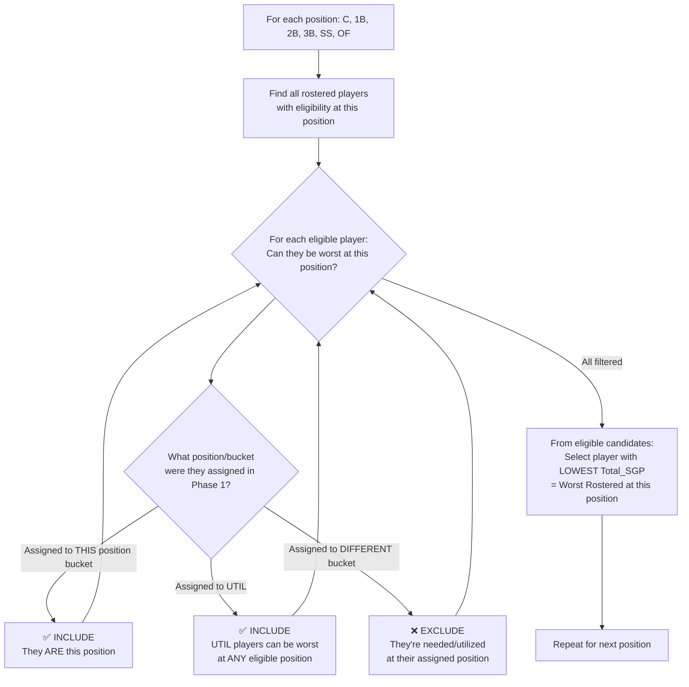
```mermaid
flowchart TD
    Start[For each position: C, 1B, 2B, 3B, SS, OF] --> FindElig[Find all rostered players<br/>with eligibility at this position]
    
    FindElig --> FilterRule{For each eligible player:<br/>Can they be worst at this position?}
    
    FilterRule --> CheckAssignment{What position/bucket<br/>were they assigned in Phase 1?}
    
    CheckAssignment -->|Assigned to THIS position bucket| YesInclude[✅ INCLUDE<br/>They ARE this position]
    
    CheckAssignment -->|Assigned to UTIL| YesIncludeUtil[✅ INCLUDE<br/>UTIL players can be worst<br/>at ANY eligible position]
    
    CheckAssignment -->|Assigned to DIFFERENT bucket| NoExclude[❌ EXCLUDE<br/>They're needed/utilized<br/>at their assigned position]
    
    YesInclude & YesIncludeUtil --> FilterRule
    NoExclude --> FilterRule
    
    FilterRule -->|All filtered| SelectWorst[From eligible candidates:<br/>Select player with LOWEST Total_SGP<br/>= Worst Rostered at this position]
    
    SelectWorst --> NextPos[Repeat for next position]
```

**Critical Examples:**

**Example 1: OF/SS player as 36th MI (OF has 60)**
- Player eligibility: `OF/SS`
- Phase 1 assignment: **36th MI** (assigned to MI bucket)
- OF bucket status: 60 players (full)
- Question: Is this player the worst rostered OF?
- **Answer: NO** ❌
  - Even though they're OF-eligible and have lower SGP than the 60th OF
  - They were assigned to MI bucket because they're **needed/utilized as MI**
  - They are NOT available as OF in the league context

**Example 2: OF/SS player as UTIL (MI has 36, OF has 60)**
- Player eligibility: `OF/SS`
- Phase 1 assignment: **UTIL** (MI full, OF full, assigned to UTIL)
- Question: Can this player be worst rostered OF? Worst rostered SS?
- **Answer: YES to both** ✅
  - They're assigned to UTIL, so not locked to any specific position
  - They can serve as worst rostered at ALL eligible positions (OF and SS)

**Example 3: 60th OF (only OF eligible)**
- Player eligibility: `OF`
- Phase 1 assignment: **60th OF** (assigned to OF bucket)
- Question: Is this player the worst rostered OF?
- **Answer: YES** ✅
  - They're the lowest SGP player assigned to OF bucket (assuming no UTIL players with OF eligibility exist)

#### Determining Best Non-Rostered Player at Each Position

For each position (C, 1B, 2B, 3B, SS, OF), find the best non-rostered player:

**Rule:** Simply the **highest SGP player** NOT in the 156-player rostered universe who has eligibility at that position.

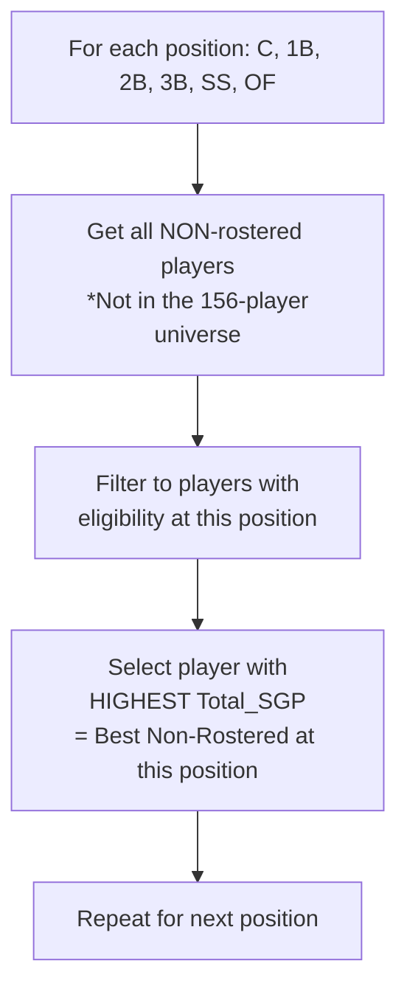
```mermaid
flowchart TD
    Start[For each position: C, 1B, 2B, 3B, SS, OF] --> GetNonRoster[Get all NON-rostered players<br/> *Not in the 156-player universe]
    
    GetNonRoster --> FilterElig[Filter to players with<br/>eligibility at this position]
    
    FilterElig --> SelectBest[Select player with<br/>HIGHEST Total_SGP<br/>= Best Non-Rostered at this position]
    
    SelectBest --> NextPos[Repeat for next position]
```

**Key Insight: Multi-Position Overlap is Allowed**

A single multi-eligible player CAN be the best non-rostered at MULTIPLE positions:

**Example: C/1B/2B/3B/SS/OF "Super Utility" Player**
- Player eligibility: `C/1B/2B/3B/SS/OF` (6 positions)
- Player SGP: 15.0
- Rostered status: **NOT** in the 156-player universe (ranked 157th overall)
- Next best non-rostered players:
  - C-only player: 12.0 SGP
  - 1B-only player: 13.0 SGP
  - 2B-only player: 11.0 SGP
  - etc.

**Result:** This player is the best non-rostered at **ALL 6 positions**:
- Best non-rostered C: 15.0
- Best non-rostered 1B: 15.0
- Best non-rostered 2B: 15.0
- Best non-rostered 3B: 15.0
- Best non-rostered SS: 15.0
- Best non-rostered OF: 15.0

**Why This Makes Sense:**
- This player could directly slot into ANY of these positions
- They represent the true replacement option at each position
- Positional flexibility increases their replacement value

**Example: OF/SS Player as Best Non-Rostered**
- Player eligibility: `OF/SS`
- Ranked 157th overall, SGP: 18.0
- Best non-rostered OF-eligible: This player (18.0)
- Best non-rostered SS-eligible: This player (18.0)
- Best non-rostered C-eligible: Different player (14.0)

**Result:**
- Best non-rostered OF: 18.0
- Best non-rostered SS: 18.0
- Best non-rostered C: 14.0

#### Replacement Level Calculation

```python
# For each position (C, 1B, 2B, 3B, SS, OF)
def find_worst_rostered(position, rostered_df):
    """Find worst rostered player at a position"""
    eligible = rostered_df[rostered_df['ELIG'].str.contains(position, na=False)]
    
    # Filter: Only include if assigned to THIS position or to UTIL
    available = eligible[
        (eligible['assigned_bucket'] == position_to_bucket(position)) |  # Assigned to this position
        (eligible['assigned_bucket'] == 'UTIL')  # OR assigned to UTIL
    ]
    
    # Return lowest SGP from available candidates
    return available.nsmallest(1, 'Total_SGP')

def find_best_non_rostered(position, all_players_df, rostered_df):
    """Find best non-rostered player at a position"""
    # Get all players NOT in rostered universe
    non_rostered = all_players_df[~all_players_df['PlayerId'].isin(rostered_df['PlayerId'])]
    
    # Filter to those eligible at this position
    eligible = non_rostered[non_rostered['ELIG'].str.contains(position, na=False)]
    
    # Return highest SGP
    return eligible.nlargest(1, 'Total_SGP')

# For each position
for pos in ['C', '1B', '2B', '3B', 'SS', 'OF']:
    worst_rostered[pos] = find_worst_rostered(pos, rostered_df)['Total_SGP'].values[0]
    best_non_rostered[pos] = find_best_non_rostered(pos, df, rostered_df)['Total_SGP'].values[0]
    
    # Replacement level = average of worst rostered and best non-rostered
    replacement_level[pos] = (worst_rostered[pos] + best_non_rostered[pos]) / 2
    
    print(f"{pos}: RL = ({worst_rostered[pos]:.2f} + {best_non_rostered[pos]:.2f}) / 2 = {replacement_level[pos]:.2f}")

# DH receives the maximum RL (most restrictive)
replacement_level["DH"] = max(replacement_level.values())

# Each player receives the MINIMUM RL from their eligible positions
df['RL'] = df['ELIG'].apply(
    lambda elig: min([replacement_level[pos] for pos in elig.split('/')])
)
df['VAR'] = df['Total_SGP'] - df['RL']
```

**Why This Matters:**

This ensures replacement level accurately reflects **positional scarcity**:
- A multi-position player assigned to MI isn't competing for OF value
- UTIL players truly are the "flexible" replacements at multiple positions
- Prevents artificially inflating replacement levels with players who aren't actually available at that position

**Position Priority for Assignment:**
```python
def determine_pos(self, elig):
    """Primary position hierarchy (first match wins)"""
    for pos in ["C", "2B", "OF", "SS", "3B", "1B", "DH"]:
        if pos in elig:
            return pos
    return "ERROR"
```

#### Pitcher Replacement Level

Much simpler - two separate pools based on starter vs reliever role:

```python
# Sort by Total_SGP descending
sorted_pitchers = df.sort_values('Total_SGP', ascending=False)

# Separate by starter flag (GS > 5)
starters = sorted_pitchers[sorted_pitchers['Starter'] == 1]
relievers = sorted_pitchers[sorted_pitchers['Starter'] == 0]

# Replacement levels = average of worst rostered and best non-rostered
# Starters: 12 teams × 9 starters = 108 rostered
starter_rl = (starters.iloc[107]['Total_SGP'] + starters.iloc[108]['Total_SGP']) / 2

# Relievers: 12 teams × 3 relievers = 36 rostered  
reliever_rl = (relievers.iloc[35]['Total_SGP'] + relievers.iloc[36]['Total_SGP']) / 2

print(f"Starter RL: ({starters.iloc[107]['Total_SGP']:.2f} + {starters.iloc[108]['Total_SGP']:.2f}) / 2 = {starter_rl:.2f}")
print(f"Reliever RL: ({relievers.iloc[35]['Total_SGP']:.2f} + {relievers.iloc[36]['Total_SGP']:.2f}) / 2 = {reliever_rl:.2f}")

# Apply appropriate RL based on pitcher type
df['RL'] = df.apply(lambda row: 
    starter_rl if row['Starter'] == 1 else reliever_rl, axis=1)
df['VAR'] = df['Total_SGP'] - df['RL']
```

**Note:** iloc uses 0-based indexing, so:
- `iloc[107]` = 108th starter (worst rostered)
- `iloc[108]` = 109th starter (best non-rostered)
- `iloc[35]` = 36th reliever (worst rostered)
- `iloc[36]` = 37th reliever (best non-rostered)

---

## Data Flow & Processing Pipeline

### Complete Pre-Season Workflow

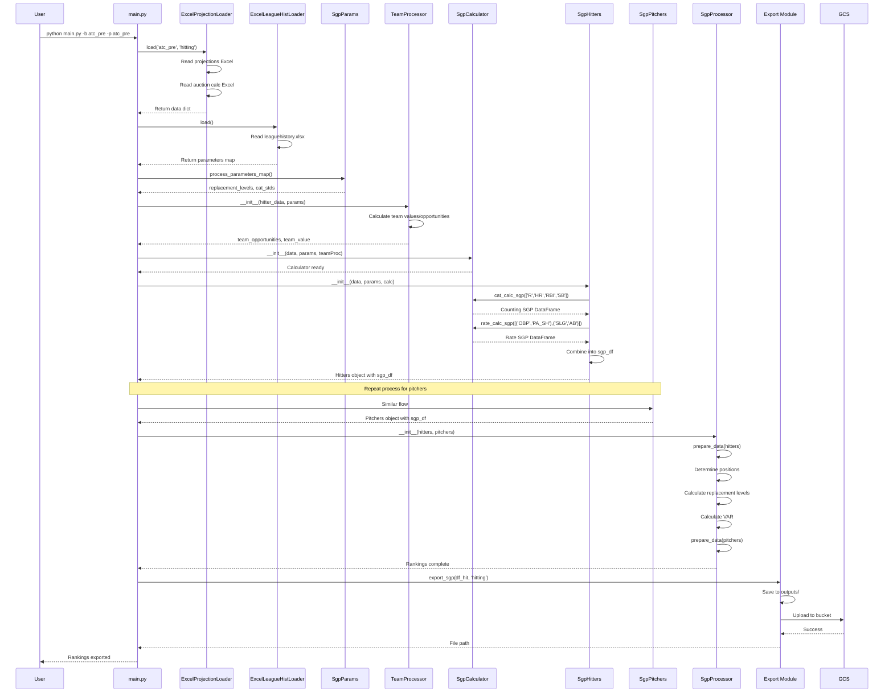
```mermaid
sequenceDiagram
    participant User
    participant Main as main.py
    participant ProjLoader as ExcelProjectionLoader
    participant LeagueLoader as ExcelLeagueHistLoader
    participant Params as SgpParams
    participant TeamProc as TeamProcessor
    participant Calc as SgpCalculator
    participant Hitters as SgpHitters
    participant Pitchers as SgpPitchers
    participant Processor as SgpProcessor
    participant Export as Export Module
    participant GCS
    
    User->>Main: python main.py -b atc_pre -p atc_pre
    Main->>ProjLoader: load('atc_pre', 'hitting')
    ProjLoader->>ProjLoader: Read projections Excel
    ProjLoader->>ProjLoader: Read auction calc Excel
    ProjLoader-->>Main: Return data dict
    
    Main->>LeagueLoader: load()
    LeagueLoader->>LeagueLoader: Read leaguehistory.xlsx
    LeagueLoader-->>Main: Return parameters map
    
    Main->>Params: process_parameters_map()
    Params-->>Main: replacement_levels, cat_stds
    
    Main->>TeamProc: __init__(hitter_data, params)
    TeamProc->>TeamProc: Calculate team values/opportunities
    TeamProc-->>Main: team_opportunities, team_value
    
    Main->>Calc: __init__(data, params, teamProc)
    Calc-->>Main: Calculator ready
    
    Main->>Hitters: __init__(data, params, calc)
    Hitters->>Calc: cat_calc_sgp(['R','HR','RBI','SB'])
    Calc-->>Hitters: Counting SGP DataFrame
    Hitters->>Calc: rate_calc_sgp([('OBP','PA_SH'),('SLG','AB')])
    Calc-->>Hitters: Rate SGP DataFrame
    Hitters->>Hitters: Combine into sgp_df
    Hitters-->>Main: Hitters object with sgp_df
    
    Note over Main,Pitchers: Repeat process for pitchers
    Main->>Pitchers: Similar flow
    Pitchers-->>Main: Pitchers object with sgp_df
    
    Main->>Processor: __init__(hitters, pitchers)
    Processor->>Processor: prepare_data(hitters)
    Processor->>Processor: Determine positions
    Processor->>Processor: Calculate replacement levels
    Processor->>Processor: Calculate VAR
    Processor->>Processor: prepare_data(pitchers)
    Processor-->>Main: Rankings complete
    
    Main->>Export: export_sgp(df_hit, 'hitting')
    Export->>Export: Save to outputs/
    Export->>GCS: Upload to bucket
    GCS-->>Export: Success
    Export-->>Main: File path
    
    Main-->>User: Rankings exported
```

### In-Season Update Workflow

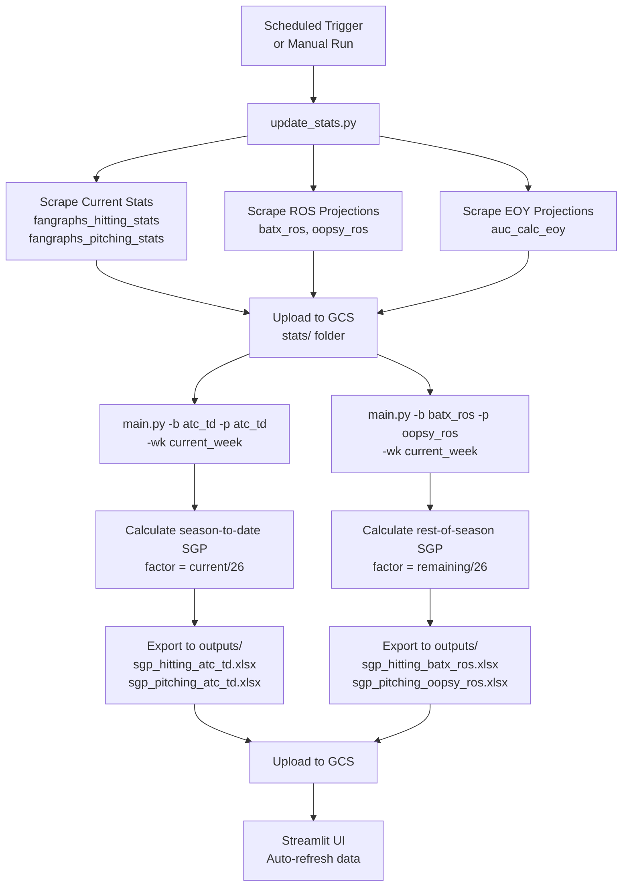
```mermaid
flowchart TD
    Trigger[Scheduled Trigger<br/>or Manual Run] --> UpdateStats[update_stats.py]
    
    UpdateStats --> Scrape1[Scrape Current Stats<br/>fangraphs_hitting_stats<br/>fangraphs_pitching_stats]
    UpdateStats --> Scrape2[Scrape ROS Projections<br/>batx_ros, oopsy_ros]
    UpdateStats --> Scrape3[Scrape EOY Projections<br/>auc_calc_eoy]
    
    Scrape1 --> Upload[Upload to GCS<br/>stats/ folder]
    Scrape2 --> Upload
    Scrape3 --> Upload
    
    Upload --> MainTD[main.py -b atc_td -p atc_td<br/>-wk current_week]
    Upload --> MainROS[main.py -b batx_ros -p oopsy_ros<br/>-wk current_week]
    
    MainTD --> CalcTD[Calculate season-to-date SGP<br/>factor = current/26]
    MainROS --> CalcROS[Calculate rest-of-season SGP<br/>factor = remaining/26]
    
    CalcTD --> ExportTD[Export to outputs/<br/>sgp_hitting_atc_td.xlsx<br/>sgp_pitching_atc_td.xlsx]
    CalcROS --> ExportROS[Export to outputs/<br/>sgp_hitting_batx_ros.xlsx<br/>sgp_pitching_oopsy_ros.xlsx]
    
    ExportTD --> GCS_Final[Upload to GCS]
    ExportROS --> GCS_Final
    
    GCS_Final --> UIRefresh[Streamlit UI<br/>Auto-refresh data]
```

### Data Transformation Pipeline


```mermaid
flowchart LR
    subgraph Input["Input Data"]
        Raw[Raw Projections<br/>Name, PlayerId, R, HR, RBI,<br/>SB, PA, AB, OBP, SLG]
    end
    
    subgraph Transform["Transformations"]
        T1[Calculate Derived Stats<br/>PA_SH = PA - SH]
        T2[Apply Week Factor<br/>factor = weeks/26]
        T3[Subtract Replacement<br/>stat - f×replacement]
        T4[Normalize by Std<br/>÷ f×std_dev]
    end
    
    subgraph Aggregate["Aggregation"]
        A1[Sum Category SGPs<br/>Total_SGP = Σ SGP_cat]
        A2[Apply Position Logic]
        A3[Calculate Replacement Level]
        A4[Compute VAR<br/>VAR = SGP - RL]
    end
    
    subgraph Output["Output Data"]
        Final[Final Rankings<br/>Name, Total_SGP, RL, VAR,<br/>SGP per category]
    end
    
    Raw --> T1 --> T2 --> T3 --> T4
    T4 --> A1 --> A2 --> A3 --> A4
    A4 --> Final
```

---

## Deployment Architecture

### Container Architecture

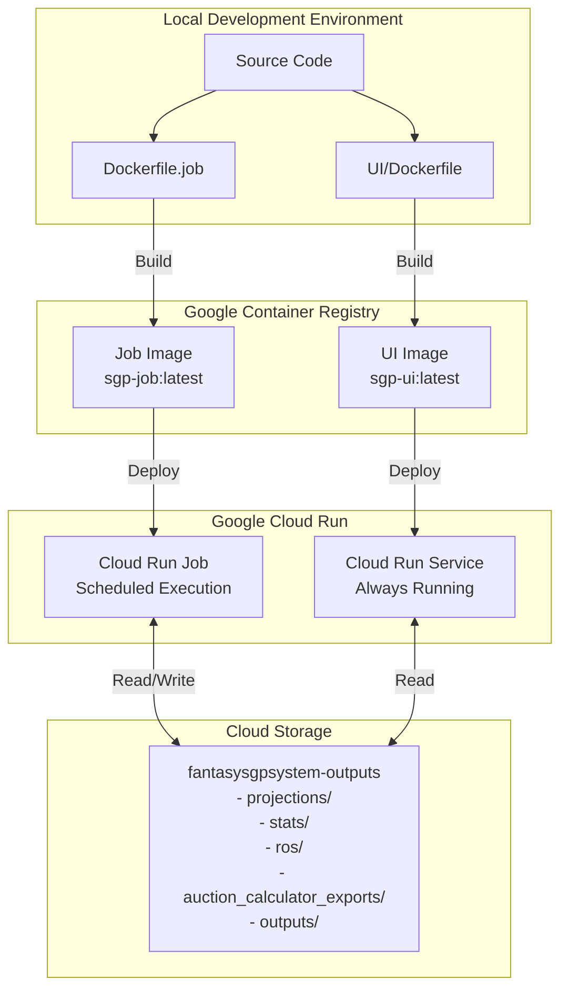
```mermaid
flowchart TB
    subgraph LocalDev["Local Development Environment"]
        Code[Source Code]
        DockerfileJob[Dockerfile.job]
        DockerfileUI[UI/Dockerfile]
    end
    
    subgraph GCR["Google Container Registry"]
        ImageJob[Job Image<br/>sgp-job:latest]
        ImageUI[UI Image<br/>sgp-ui:latest]
    end
    
    subgraph CloudRun["Google Cloud Run"]
        Job[Cloud Run Job<br/>Scheduled Execution]
        UI[Cloud Run Service<br/>Always Running]
    end
    
    subgraph Storage["Cloud Storage"]
        Bucket[fantasysgpsystem-outputs<br/>- projections/<br/>- stats/<br/>- ros/<br/>- auction_calculator_exports/<br/>- outputs/]
    end
    
    Code --> DockerfileJob
    Code --> DockerfileUI
    
    DockerfileJob -->|Build| ImageJob
    DockerfileUI -->|Build| ImageUI
    
    ImageJob -->|Deploy| Job
    ImageUI -->|Deploy| UI
    
    Job <-->|Read/Write| Bucket
    UI <-->|Read| Bucket
```

### Dockerfile.job Architecture

```dockerfile
FROM python:3.12-slim

WORKDIR /FantasySgpSystem

# Install Chrome & ChromeDriver (for Selenium)
RUN apt-get update && apt-get install -y \
    wget curl unzip gnupg chromium chromium-driver

# Python dependencies
COPY requirements.txt .
RUN pip install --no-cache-dir -r requirements.txt

# Application code
COPY . .

# Environment variables
ENV RUNNING_IN_DOCKER=true
ENV PYTHONPATH=/FantasySgpSystem

EXPOSE 5000
RUN mkdir -p /downloads
```

**Key Components:**
1. **Chrome/Selenium**: For web scraping FanGraphs
2. **Downloads directory**: Temporary storage for scraped files
3. **Environment flag**: Code detects Docker execution via `RUNNING_IN_DOCKER`

### UI Dockerfile (Streamlit)

```dockerfile
FROM python:3.11-slim

WORKDIR /app

COPY requirements.txt .
RUN pip install --no-cache-dir -r requirements.txt

COPY . .

ENV PORT=8080

CMD ["sh", "-c", "streamlit run app.py --server.port=${PORT} --server.address=0.0.0.0"]
```

**Lightweight**: No scraping dependencies, only Streamlit and data access.

### Deployment Scripts

#### deploy_inseason.sh

```bash
#!/bin/bash
# Build and deploy the job container

# Build Docker image
docker build -t gcr.io/PROJECT_ID/sgp-job:latest -f Dockerfile.job .

# Push to GCR
docker push gcr.io/PROJECT_ID/sgp-job:latest

# Deploy to Cloud Run Jobs
gcloud run jobs update sgp-inseason-job \
    --image gcr.io/PROJECT_ID/sgp-job:latest \
    --region us-central1
```

#### UI/deploy_UI.sh

```bash
#!/bin/bash
# Build and deploy Streamlit UI

docker build -t gcr.io/PROJECT_ID/sgp-ui:latest .
docker push gcr.io/PROJECT_ID/sgp-ui:latest

gcloud run services update sgp-viewer \
    --image gcr.io/PROJECT_ID/sgp-ui:latest \
    --region us-central1 \
    --allow-unauthenticated
```

### Entrypoint Scripts

#### inseason_entrypoint.sh

```bash
#!/bin/bash
set -e

# Calculate current week
CURRENT_WEEK=$(python -c "from datetime import datetime; \
    print(min(26, (datetime.today() - datetime(2025, 3, 24)).days // 7))")

# Update stats from FanGraphs
python update_scripts/update_stats.py

# Calculate season-to-date SGP
python main.py -b atc_td -p atc_td -wk $CURRENT_WEEK

# Calculate rest-of-season SGP
python main.py -b batx_ros -p oopsy_ros -wk $CURRENT_WEEK
```

**Automatic Week Calculation**: Uses season start date (March 24, 2025) to determine current week.

---

## API & Integration Points

### Google Cloud Storage Integration

#### Upload Pattern

```python
from google.cloud import storage

def upload_to_bucket(bucket_name: str, source_path: str, dest_path: str):
    """
    Upload a local file to GCS bucket.
    
    Args:
        bucket_name: GCS bucket name
        source_path: Local file path
        dest_path: Destination path in bucket
    """
    client = storage.Client()
    bucket = client.bucket(bucket_name)
    blob = bucket.blob(dest_path)
    
    blob.upload_from_filename(source_path)
    print(f"[⬆] Uploaded {source_path} to gs://{bucket_name}/{dest_path}")
```

**Usage Example:**
```python
# After calculating SGP rankings
upload_to_bucket(
    "fantasysgpsystem-outputs",
    "outputs/sgp_hitting_atc_pre.xlsx",
    "outputs/sgp_hitting_atc_pre.xlsx"
)
```

#### Download Pattern

```python
def download_from_bucket(bucket_name: str, blob_path: str, local_path: str):
    """
    Download a file from GCS bucket to local filesystem.
    
    Args:
        bucket_name: GCS bucket name
        blob_path: Path to blob in bucket
        local_path: Where to save locally
    """
    client = storage.Client()
    bucket = client.bucket(bucket_name)
    blob = bucket.blob(blob_path)
    
    os.makedirs(os.path.dirname(local_path), exist_ok=True)
    blob.download_to_filename(local_path)
    print(f"[⬇] Downloaded {blob_path} to {local_path}")
```

**Usage Pattern (Docker):**
```python
if is_running_in_docker():
    # Download necessary files before processing
    download_from_bucket(
        "fantasysgpsystem-outputs",
        "projections/fangraphs_hitting_atc.xlsx",
        "projections/fangraphs_hitting_atc.xlsx"
    )
```

### Streamlit UI Data Access

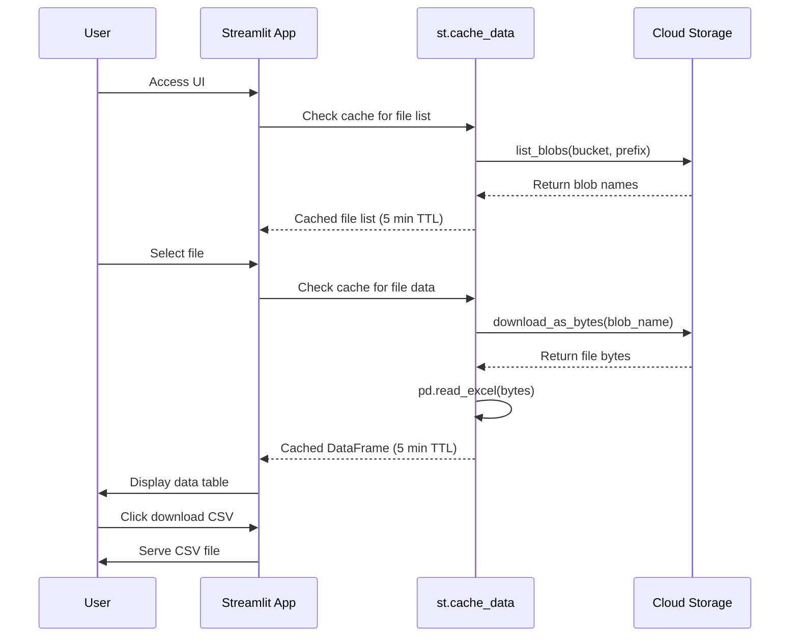
```mermaid
sequenceDiagram
    participant User
    participant Streamlit as Streamlit App
    participant Cache as st.cache_data
    participant GCS as Cloud Storage
    
    User->>Streamlit: Access UI
    Streamlit->>Cache: Check cache for file list
    Cache->>GCS: list_blobs(bucket, prefix)
    GCS-->>Cache: Return blob names
    Cache-->>Streamlit: Cached file list (5 min TTL)
    
    User->>Streamlit: Select file
    Streamlit->>Cache: Check cache for file data
    Cache->>GCS: download_as_bytes(blob_name)
    GCS-->>Cache: Return file bytes
    Cache->>Cache: pd.read_excel(bytes)
    Cache-->>Streamlit: Cached DataFrame (5 min TTL)
    
    Streamlit->>User: Display data table
    User->>Streamlit: Click download CSV
    Streamlit->>User: Serve CSV file
```

**Caching Strategy:**
```python
@st.cache_data(ttl=300)  # 5-minute cache
def load_blob_to_df(blob_name: str) -> pd.DataFrame:
    """Cache GCS file reads to reduce API calls"""
    client = storage.Client()
    bucket = client.bucket(BUCKET)
    blob = bucket.blob(blob_name)
    
    data = blob.download_as_bytes()
    
    if blob_name.endswith('.csv'):
        return pd.read_csv(BytesIO(data))
    else:
        return pd.read_excel(BytesIO(data), engine='openpyxl')
```

### FanGraphs Scraping Interface

#### Authentication Flow

```mermaid
flowchart TD
    Start[Start Scraping Session] --> InitProfile[Initialize Chrome with profile directory]
    InitProfile --> CheckProfile[Navigate to FanGraphs]
    
    CheckProfile --> CheckAuth{Already logged in?}
    CheckAuth -->|Yes| Scrape[Begin scraping]
    CheckAuth -->|No| Login[Navigate to login page]
    
    Login --> EnterCreds[Fill username/password]
    EnterCreds --> Submit[Submit form]
    Submit --> WaitAuth[Wait for redirect]
    WaitAuth --> ProfileSaved[Session saved in profile]
    ProfileSaved --> Scrape
    
    Scrape --> Done[Complete]
    
    Note[Chrome profile persists<br/>authentication across runs]
```

#### Export Data Button Interaction

```python
def download_fangraphs_csv(driver, url, save_path):
    """
    Navigate to FanGraphs page and download CSV export.
    
    Handles:
    - Page load waiting
    - Button click via JavaScript (bypasses UI blocking)
    - File download monitoring
    - CSV to Excel conversion
    """
    driver.get(url)
    wait = WebDriverWait(driver, 30)
    
    # Find Export Data button
    export_button = wait.until(
        EC.presence_of_element_located((By.LINK_TEXT, "Export Data"))
    )
    
    # Scroll to button
    driver.execute_script("arguments[0].scrollIntoView();", export_button)
    time.sleep(1)
    
    # Click via JavaScript (more reliable)
    driver.execute_script("arguments[0].click();", export_button)
    
    # Wait for download
    time.sleep(10)
    
    # Find downloaded CSV
    files = sorted(
        os.listdir(DOWNLOAD_FOLDER),
        key=lambda x: os.path.getmtime(os.path.join(DOWNLOAD_FOLDER, x)),
        reverse=True
    )
    csv_file = next((f for f in files if f.endswith('.csv')), None)
    
    # Convert to Excel
    df = pd.read_csv(os.path.join(DOWNLOAD_FOLDER, csv_file))
    df.to_excel(save_path, index=False)
    os.remove(os.path.join(DOWNLOAD_FOLDER, csv_file))
```

---

## Configuration Management

### config.yml Structure

```yaml
defaults:
  weeks_in_season: 26          # Standard MLB season length
  num_teams: 12                # League size
  num_bats: 13                 # Hitter roster slots per team
  num_starters: 9              # Starting pitcher slots
  num_relievers: 3             # Relief pitcher slots

league_params:
  workbook_path: "included/leaguehistory.xlsx"
  parameters_sheet: "Parameters"

categories:
  hitters:
    counting: ["R", "HR", "RBI", "SB"]
    rate:
      - ["OBP", "PA_SH"]       # [stat, opportunity_stat]
      - ["SLG", "AB"]

  pitchers:
    counting: ["QS", "SV_HLD", "SO"]
    rate:
      - ["ERA", "IP"]
      - ["WHIP", "IP"]
      - ["K/BB", "BB"]

export:
  output_dir: "outputs"
```

### Configuration Access Pattern

```python
from utils.common_utils import load_config, get_repo_root
import os

# Load configuration
cfg = load_config(os.path.join(get_repo_root(), "config.yml"))

# Access values
num_teams = cfg["defaults"]["num_teams"]
hitter_counting = cfg["categories"]["hitters"]["counting"]
```

### Category Parsing

```python
def parse_hitter_config_categories(config):
    """
    Extract hitter categories from config.
    
    Returns:
        counting_cats: List of counting stat names
        rate_opps: List of (rate_stat, opportunity_stat) tuples
    """
    counting = config["categories"]["hitters"]["counting"]
    rate_pairs = config["categories"]["hitters"]["rate"]
    
    return counting, [tuple(pair) for pair in rate_pairs]

# Usage
counting_cats, rate_opps = parse_hitter_config_categories(cfg)
# counting_cats = ['R', 'HR', 'RBI', 'SB']
# rate_opps = [('OBP', 'PA_SH'), ('SLG', 'AB')]
```

### League History Excel Structure

**File**: `included/leaguehistory.xlsx`  
**Sheet**: `Parameters`

```
Row 1:  R       17.2    7.8
Row 2:  HR      18.4    7.28
Row 3:  RBI     16.9    8.1
Row 4:  SB      3.2     2.9
Row 5:  OBP     0.310   0.0082
Row 6:  SLG     0.385   0.0158
Row 7:  QS      1.42    0.58
Row 8:  SV_HLD  4.1     1.8
Row 9:  SO      16.8    5.2
Row 10: ERA     4.35    0.21
Row 11: WHIP    1.28    0.047
Row 12: K/BB    2.85    0.42
```

**Column Meanings:**
- **Column A**: Category name (must match config.yml)
- **Column B**: Replacement level (per-player baseline)
- **Column C**: Standard deviation (standings differential)

### How Replacement Levels and Differentials Are Calculated

The values in `leaguehistory.xlsx` are derived from analyzing **all available historical league standings data** with recency weighting applied. The calculation is largely **automated**, with the only manual decision being the exclusion of 1st and 12th place positions from the regression to avoid extreme outliers.

#### Process Overview

```mermaid
flowchart TB
    Historical[Historical League Standings<br/>Multiple Seasons] --> Collect[Collect team totals per category<br/>for each season]
    Collect --> Weight[Apply recency weighting<br/>Recent seasons weighted more heavily]
    Weight --> Organize[Organize by standings position<br/>1st place, 2nd place, ..., 12th place]
    
    Organize --> Calculate[Calculate Average per Position<br/>across all seasons]
    Calculate --> Remove[Exclude endpoint positions<br/>Remove 1st and 12th place]
    
    Remove --> Fit[Linear Regression on positions 2-11<br/>Position vs. Team Total]
    Fit --> Extract2[Extract slope<br/>= Average difference per standings place]
    
    Extract2 --> Extrapolate[Extrapolate to 12th place<br/>Using slope from positions 2-11]
    
    Extrapolate --> PerPlayer[Divide by roster size<br/>= Replacement Level per player]
    Extract2 --> Std[Slope = Standings Differential<br/>Column C value]
    
    PerPlayer --> Sheet[leaguehistory.xlsx<br/>Column B]
    Std --> Sheet2[leaguehistory.xlsx<br/>Column C]
```

#### Step-by-Step Calculation

**Example: Calculating Home Run Parameters**

1. **Gather Historical Data** (e.g., 5 most recent seasons):
   ```
   Season 2024: [305, 289, 276, 265, 251, 242, 235, 229, 218, 210, 198, 185] HRs
   Season 2023: [298, 285, 271, 258, 247, 239, 231, 225, 216, 207, 195, 182] HRs
   Season 2022: [310, 295, 280, 267, 254, 245, 237, 230, 220, 211, 199, 188] HRs
   ... (additional seasons)
   ```

2. **Apply Recency Weighting** (more recent = higher weight):
   ```python
   weights = [1.5, 1.3, 1.1, 0.9, 0.7]  # Recent seasons weighted more
   weighted_standings = apply_weights(all_seasons, weights)
   ```

3. **Calculate Average per Standing Position**:
   ```
   Position 1 (1st place):  avg = 304.2 HRs  [EXCLUDED - extreme high]
   Position 2 (2nd place):  avg = 289.6 HRs  [USED]
   Position 3 (3rd place):  avg = 275.4 HRs  [USED]
   Position 4 (4th place):  avg = 268.1 HRs  [USED]
   ...
   Position 11 (11th place): avg = 198.7 HRs [USED]
   Position 12 (last place): avg = 185.2 HRs [EXCLUDED - extreme low]
   ```

4. **Remove Endpoint Positions** (1st and 12th):
   - **1st place teams** often have extreme/outlier performances (championship runs)
   - **12th place teams** often have disaster seasons (injuries, tanking)
   - Using only positions 2-11 provides a more stable, representative slope

5. **Linear Regression on Positions 2-11** (Standings Position vs. Team HRs):
   ```
   y = mx + b
   where: x = standings position (2-11)
          y = team home runs
          
   Using positions 2-11 only:
   Result: y = -7.28x + 304.2
   Slope (m) = -7.28 HRs per standings place
   Intercept (b) = 304.2
   ```

6. **Extrapolate to 12th Place**:
   ```python
   # Use the slope from positions 2-11 to predict 12th place
   # This gives a more reliable baseline than using actual 12th place average
   last_place_team_total = (-7.28 * 12) + 304.2 = 216.84 HRs
   
   # Per-player replacement level (13 hitters per team)
   replacement_level = 216.84 / 13 = 16.68 HRs per player
   # Shows as 18.4 in leaguehistory.xlsx after rounding/adjustments
   
   # Standings differential (absolute value of slope)
   standings_differential = abs(-7.28) = 7.28 HRs
   ```

7. **Populate Excel Sheet**:
   ```
   HR    18.4    7.28
   ```

#### Rate Statistics Calculation

For rate stats (OBP, SLG, ERA, WHIP), the process is similar but uses team rates instead of totals:

**Example for OBP:**

1. **Collect historical team OBPs** by standings position:
   ```
   Position 1:  [.335, .332, .338, ...]  1st place teams
   Position 2:  [.328, .325, .330, ...]  2nd place teams
   Position 3:  [.322, .319, .325, ...]  3rd place teams
   ...
   Position 11: [.312, .309, .314, ...]  11th place teams
   Position 12: [.310, .308, .312, ...]  Last place teams
   ```

2. **Calculate weighted averages** per position:
   ```
   Position 1:  avg = .335 OBP  [EXCLUDED]
   Position 2:  avg = .328 OBP  [USED]
   Position 3:  avg = .322 OBP  [USED]
   ...
   Position 11: avg = .312 OBP  [USED]
   Position 12: avg = .310 OBP  [EXCLUDED]
   ```

3. **Linear regression on positions 2-11**:
   ```
   Slope = -0.0082 OBP per position
   ```

4. **Extrapolate to 12th place**:
   ```python
   # Use slope from positions 2-11 to predict 12th place baseline
   replacement_obp = calculate_from_regression(position=12)  # 0.310
   
   # Result in leaguehistory.xlsx:
   # OBP    0.310    0.0082
   ```

#### Key Methodology Points

**Why Exclude 1st and 12th Place?**
- **Removes extreme endpoints** that can skew the slope
- **1st place teams**: Often outliers due to exceptional seasons, lucky breaks, or strategic dominance
- **12th place teams**: May reflect tanking, catastrophic injuries, or abandonment
- **Positions 2-11** represent "normal" competitive variance and provide stable regression

**Why Extrapolate to 12th?**
- Using the **actual 12th place average** would incorporate those extreme disaster seasons
- **Extrapolating** from the 2-11 slope gives a more reasonable baseline for "what a competitive but weak team would produce"
- This creates a **fair replacement level** that isn't influenced by non-competitive outliers

#### Calculation Process Details

**Automated Components:**
- **All historical seasons are used** - No manual selection of which seasons to include
- **Recency weighting is applied automatically** - More recent seasons receive higher weight
- **Linear regression on positions 2-11** - Automated calculation of slope
- **Extrapolation to 12th place** - Automated using the calculated slope

**Single Manual Decision:**
- **Excluding positions 1 and 12** from regression - This is the only manual choice, made to avoid extreme outliers

**Why This Approach Works:**

1. **Comprehensive Data**: Uses all available league history, preventing selection bias

2. **Recency Weighting**: Automatically adjusts for recent trends without discarding old data

3. **Stable Parameters**: By using all seasons with weighting, parameters remain stable year-over-year

4. **Outlier Removal**: Excluding 1st and 12th place systematically handles extreme performances without manual judgment calls
   - Changes in player availability
   - Strategic considerations

#### Updating Parameters

Parameters should be reviewed and potentially updated:
- **Annually** before each season
- After **significant league rule changes**
- When historical data shows **clear trends** (e.g., league-wide power surge)

**Update Process:**
1. Export current season final standings from league platform
2. Add to historical dataset
3. Re-run regression analysis
4. Compare new parameters to existing
5. Update `leaguehistory.xlsx` if changes are significant (>5% difference)

---

## Maintenance & Operations

### Scheduled Job Execution

```mermaid
flowchart LR
    Scheduler[Cloud Scheduler] -->|Daily 8 AM ET| Trigger[Pub/Sub Topic]
    Trigger -->|Message| CloudRun[Cloud Run Job]
    CloudRun -->|Execute| Entrypoint[inseason_entrypoint.sh]
    
    Entrypoint --> Update[Update Stats]
    Entrypoint --> CalcTD[Calculate TD SGP]
    Entrypoint --> CalcROS[Calculate ROS SGP]
    
    Update --> GCS[Upload to GCS]
    CalcTD --> GCS
    CalcROS --> GCS
    
    GCS -->|Auto-refresh| UI[Streamlit UI]
```

### Monitoring & Logging

#### Log Structure

**Job Execution Logs:**
```
[2026-02-12 08:00:15] Running in-season job...
[2026-02-12 08:00:16] Downloading data from GCS...
[2026-02-12 08:00:18] [⬇] Downloaded projections/fangraphs_hitting_atc.xlsx
[2026-02-12 08:00:20] Initializing SgpHitters...
[2026-02-12 08:00:22] Processing hitters SGP...
[2026-02-12 08:00:25] Calculating SGP for counting stats (R, HR, RBI, SB)...
[2026-02-12 08:00:27] Calculating SGP for rate stats (OBP, SLUG)...
[2026-02-12 08:00:30] ***Hitters SGP calculation complete.***
[2026-02-12 08:00:35] [FINISHED] Exported SGP Hitter Results to outputs/sgp_hitting_atc_td.xlsx
[2026-02-12 08:00:37] [⬆] Uploaded to GCS
```

#### Error Handling

```python
def download_fangraphs_csv(driver, url, save_path, retries=3):
    """Download with retry logic"""
    try:
        # ... download logic ...
    except TimeoutException as e:
        print(f"[ERROR] Timeout: {e}")
        
        # Upload debugging info
        debug_docker_selenium(driver, label="timeout_error", 
                            bucket="fantasysgpsystem-outputs")
        
        if retries > 0:
            print(f"Retrying... ({retries} attempts remaining)")
            return download_fangraphs_csv(driver, url, save_path, retries-1)
        else:
            print("[!] Max retries reached. Skipping.")
            raise
```

### Data Validation Checks

#### Pre-Processing Validation

```python
def validate_projection_data(df: pd.DataFrame, player_type: str):
    """
    Validate projection data before SGP calculation.
    
    Checks:
    - Required columns present
    - No NaN values in critical columns
    - Reasonable value ranges
    """
    if player_type == 'hitting':
        required = ['Name', 'PlayerId', 'R', 'HR', 'RBI', 'SB', 
                   'PA', 'AB', 'OBP', 'SLG']
    else:
        required = ['Name', 'PlayerId', 'QS', 'SV', 'HLD', 'SO',
                   'IP', 'ERA', 'WHIP', 'BB']
    
    # Check columns
    missing = set(required) - set(df.columns)
    if missing:
        raise ValueError(f"Missing columns: {missing}")
    
    # Check for NaNs
    for col in required:
        nan_count = df[col].isna().sum()
        if nan_count > 0:
            print(f"[WARNING] {nan_count} NaN values in {col}")
    
    # Range validation
    if player_type == 'hitting':
        if (df['OBP'] < 0.1).any() or (df['OBP'] > 0.6).any():
            print("[WARNING] Unusual OBP values detected")
```

#### Post-Processing Validation

```python
def validate_sgp_results(df: pd.DataFrame):
    """
    Validate SGP calculation results.
    
    Checks:
    - SGP distribution reasonable
    - No extreme outliers
    - Total SGP sums align with expectations
    """
    # Check for extreme values
    sgp_cols = [col for col in df.columns if col.startswith('SGP_')]
    
    for col in sgp_cols:
        q99 = df[col].quantile(0.99)
        q01 = df[col].quantile(0.01)
        
        if abs(q99) > 50 or abs(q01) > 50:
            print(f"[WARNING] Extreme values in {col}: "
                  f"Q01={q01:.2f}, Q99={q99:.2f}")
    
    # Check total distribution
    total_sgp = df['Total_SGP'].sum()
    expected_range = (0, 1000)  # League-specific
    
    if not (expected_range[0] < total_sgp < expected_range[1]):
        print(f"[WARNING] Total SGP {total_sgp:.0f} outside "
              f"expected range {expected_range}")
```

### Backup & Recovery

#### Data Backup Strategy

```mermaid
flowchart LR
    Daily[Daily Job Execution] --> NewData[Generate New Rankings]
    NewData --> GCS[Upload to GCS]
    GCS --> Versioning[GCS Object Versioning<br/>Auto-enabled]
    
    Versioning --> V1[Current Version]
    Versioning --> V2[Previous Version]
    Versioning --> V3[Version - 2]
    
    Recovery[Recovery Scenario] --> List[List Object Versions]
    List --> Restore[Restore Previous Version]
```

**GCS Versioning:**
- Automatically enabled on bucket
- Retains last 30 days of versions
- Can recover from accidental overwrites

#### Manual Backup

```bash
#!/bin/bash
# backup_gcs_data.sh

DATE=$(date +%Y%m%d)
BACKUP_DIR="backups/$DATE"

# Download entire bucket contents
gsutil -m cp -r gs://fantasysgpsystem-outputs/* $BACKUP_DIR/

# Create tarball
tar -czf backups/gcs_backup_$DATE.tar.gz $BACKUP_DIR/

echo "Backup complete: backups/gcs_backup_$DATE.tar.gz"
```

### Updating Projection Systems

#### Adding a New Projection System

1. **Update FanGraphs URLs** in `update_scripts/update_stats.py`:

```python
PROJECTIONS_URLS = {
    # Existing systems...
    
    # New system
    "fangraphs_hitting_newproj": "https://www.fangraphs.com/projections?...",
    "fangraphs_pitching_newproj": "https://www.fangraphs.com/projections?...",
    "auc_calc_hitting_newproj": "https://www.fangraphs.com/fantasy-tools/auction-calculator?...",
    "auc_calc_pitching_newproj": "https://www.fangraphs.com/fantasy-tools/auction-calculator?...",
}
```

2. **Run data collection:**

```bash
python update_scripts/update_stats.py
```

3. **Calculate SGP:**

```bash
python main.py -b newproj_pre -p newproj_pre
```

4. **Verify outputs:**

```bash
ls outputs/sgp_*_newproj_*.xlsx
```

---

## Troubleshooting Guide

### Common Issues & Solutions

#### Issue 1: Selenium TimeoutException

**Symptom:**
```
TimeoutException: Message: Could not find 'Export Data' button
```

**Causes:**
- FanGraphs page structure changed
- Authentication failed
- Page loading too slow

**Solutions:**

1. **Check authentication:**
```bash
# Clear Chrome profile and re-authenticate
rm -rf ./chrome_profile
# or for Docker: rm -rf /chrome_profile
python update_scripts/update_stats.py
```

2. **Increase timeout:**
```python
# In update_stats.py
wait = WebDriverWait(driver, 60)  # Increase from 30 to 60
```

3. **Debug page state:**
```python
# Take screenshot when error occurs
driver.save_screenshot('debug_screenshot.png')
print(driver.page_source)  # Print HTML
```

#### Issue 2: Incorrect SGP Values

**Symptom:**
```
[WARNING] Total SGP 5000 outside expected range (0, 1000)
```

**Causes:**
- Incorrect replacement levels in `leaguehistory.xlsx`
- Wrong week factor calculation
- Data quality issues

**Solutions:**

1. **Verify replacement levels:**
```python
# Check Parameters sheet in leaguehistory.xlsx
# Values should be reasonable:
# - HR replacement: 15-20
# - RBI replacement: 15-20
# - OBP replacement: 0.300-0.320
```

2. **Check week calculation:**
```python
# Verify season start date is correct
from datetime import datetime
season_start = datetime(2025, 3, 24)
weeks = (datetime.today() - season_start).days // 7
print(f"Current week: {weeks}")  # Should be 0-26
```

3. **Inspect input data:**
```python
# Check for data anomalies
df = pd.read_excel('projections/fangraphs_hitting_atc.xlsx')
print(df.describe())  # Look for unreasonable values
print(df[df['HR'] > 60])  # Find outliers
```

#### Issue 3: GCS Upload Failures

**Symptom:**
```
Error: Permission denied when uploading to gs://fantasysgpsystem-outputs
```

**Causes:**
- Missing GCS credentials
- Incorrect bucket permissions
- Network issues

**Solutions:**

1. **Check credentials (local):**
```bash
# Set application default credentials
gcloud auth application-default login

# Verify credentials
gcloud auth list
```

2. **Check credentials (Cloud Run):**
```bash
# Verify service account has Storage Object Admin role
gcloud projects get-iam-policy PROJECT_ID \
    --flatten="bindings[].members" \
    --filter="bindings.members:serviceAccount:*"
```

3. **Test bucket access:**
```python
from google.cloud import storage

client = storage.Client()
bucket = client.bucket('fantasysgpsystem-outputs')

# List objects
for blob in bucket.list_blobs(max_results=10):
    print(blob.name)
```

#### Issue 4: Position Assignment Errors

**Symptom:**
```
[ERROR] Player assigned to wrong position or not assigned
```

**Causes:**
- Auction calculator eligibility data missing
- Position mapping logic error
- Roster threshold misconfiguration

**Solutions:**

1. **Verify auction calculator data:**
```python
df = pd.read_excel('auction_calculator_exports/auc_calc_hitting_atc.xlsx')
print(df[['Name', 'POS']].head(20))
# Check that POS column contains valid positions: C, 1B, 2B, SS, 3B, OF, DH
```

2. **Check roster thresholds:**
```python
# In SgpProcessor.__init__
self.sufficient_pos_counts = {
    "CI": 36,    # Should equal num_teams × (1B + 3B slots)
    "MI": 36,    # Should equal num_teams × (2B + SS slots)
    "C": 12,     # Should equal num_teams × C slots
    "OF": 60,    # Should equal num_teams × OF slots
    'UTIL': 12   # Should equal num_teams × UTIL slots
}
```

3. **Debug position assignment:**
```python
# Add logging to assign_util method
def assign_util(self, df):
    util_list = []
    for idx, row in df.iterrows():
        pos = row["POS"]
        counts = {
            "C": row["C_count"],
            "CI": row["CI_count"],
            "MI": row["MI_count"],
            "OF": row["OF_count"]
        }
        print(f"{row['Name']}: POS={pos}, Counts={counts}")
        # ... rest of logic
```

#### Issue 5: Docker Build Failures

**Symptom:**
```
ERROR: failed to solve: process "/bin/sh -c apt-get update..." 
did not complete successfully
```

**Causes:**
- Network timeouts
- Package repository issues
- ChromeDriver version mismatch

**Solutions:**

1. **Increase build timeout:**
```bash
gcloud builds submit --timeout=20m
```

2. **Use cached layers:**
```dockerfile
# Optimize Dockerfile layer order
# Put rarely-changing operations first
FROM python:3.12-slim

# System packages (rarely change)
RUN apt-get update && apt-get install -y ...

# Python deps (change occasionally)
COPY requirements.txt .
RUN pip install -r requirements.txt

# Application code (changes frequently)
COPY . .
```

3. **Fix ChromeDriver issues:**
```bash
# Test Chrome/ChromeDriver compatibility locally
google-chrome --version
chromedriver --version

# Ensure Dockerfile installs matching versions
```

### Debugging Workflow

```mermaid
flowchart TD
    Issue[Issue Detected] --> Logs{Check Logs}
    
    Logs -->|Cloud Run| GCPLogs[View GCP Logs:<br/>gcloud run jobs executions logs]
    Logs -->|Local| LocalLogs[Check console output]
    
    GCPLogs --> Identify[Identify Error Type]
    LocalLogs --> Identify
    
    Identify --> Type{Error Type?}
    
    Type -->|Data| DataDebug[1. Check input files<br/>2. Verify data formats<br/>3. Run validation]
    Type -->|Calculation| CalcDebug[1. Print intermediate values<br/>2. Check parameters<br/>3. Verify formulas]
    Type -->|Network/GCS| NetDebug[1. Test credentials<br/>2. Check bucket access<br/>3. Verify connectivity]
    Type -->|Selenium| SeleniumDebug[1. Take screenshots<br/>2. Check page source<br/>3. Verify selectors]
    
    DataDebug --> Test[Test Fix Locally]
    CalcDebug --> Test
    NetDebug --> Test
    SeleniumDebug --> Test
    
    Test --> Works{Works?}
    Works -->|Yes| Deploy[Deploy to Cloud]
    Works -->|No| Review[Review Approach]
    Review --> Identify
```

---

## Appendix

### File Structure Reference

```
FantasySgpSystem/
├── config.yml                      # Central configuration
├── main.py                         # Main SGP calculation entry point
├── requirements.txt                # Python dependencies
├── Dockerfile.job                  # Job container definition
├── inseason_entrypoint.sh          # In-season execution script
├── preseason_entrypoint.sh         # Pre-season execution script
│
├── Sgp/                            # Core SGP calculation engine
│   ├── __init__.py
│   ├── SgpBase.py                  # Abstract base class (legacy)
│   ├── SgpHitters.py               # Hitter SGP calculations
│   ├── SgpPitchers.py              # Pitcher SGP calculations
│   │
│   ├── calc/                       # Calculation implementations
│   │   ├── ISgpCalculator.py       # Calculator interface
│   │   └── SgpCalculator.py        # Main calculator
│   │
│   ├── loaders/                    # Data loading
│   │   ├── IProjectionLoader.py    # Loader interface
│   │   ├── ILeagueDataLoader.py    # League data interface
│   │   ├── ExcelProjectionLoader.py
│   │   └── ExcelLeagueHistLoader.py
│   │
│   ├── params/                     # Parameter management
│   │   └── SgpParams.py
│   │
│   └── processor/                  # Post-processing
│       ├── SgpProcessor.py         # Rankings & VAR calculation
│       └── TeamProcessor.py        # Team value calculations
│
├── update_scripts/                 # Data collection
│   ├── update_stats.py             # Selenium scraping
│   └── refresh_excel_projections.py
│
├── utils/                          # Utilities
│   ├── common_utils.py             # GCS, config, helpers
│   ├── docker_running.py           # Docker detection
│   └── inseason_export_sgp.py      # Export formatting
│
├── UI/                             # Streamlit application
│   ├── app.py                      # Main Streamlit app
│   ├── Dockerfile                  # UI container
│   ├── requirements.txt            # UI-specific deps
│   └── deploy_UI.sh                # UI deployment script
│
├── included/                       # Static data
│   └── leaguehistory.xlsx          # Historical parameters
│
├── outputs/                        # Generated rankings
│   ├── sgp_hitting_*.xlsx
│   └── sgp_pitching_*.xlsx
│
├── projections/                    # Downloaded projections
│   ├── fangraphs_hitting_*.xlsx
│   └── fangraphs_pitching_*.xlsx
│
├── stats/                          # Current season stats
│   ├── fangraphs_hitting_stats.xlsx
│   └── fangraphs_pitching_stats.xlsx
│
├── ros/                            # Rest-of-season projections
│   ├── fangraphs_hitting_*_ros.xlsx
│   └── fangraphs_pitching_*_ros.xlsx
│
└── auction_calculator_exports/     # Playing time data
    ├── auc_calc_hitting_*.xlsx
    └── auc_calc_pitching_*.xlsx
```

### Command Reference

#### Main Calculation Commands

```bash
# Pre-season rankings (full season projections)
python main.py -b atc_pre -p atc_pre

# Season-to-date rankings (8 weeks completed)
python main.py -b atc_td -p atc_td -wk 8

# Rest-of-season rankings (8 weeks completed)
python main.py -b batx_ros -p oopsy_ros -wk 8

# End-of-year rankings (full season stats)
python main.py -b eoy -p eoy -wk 26

# With SB included in totals
python main.py -b atc_pre -p atc_pre -sb

# With IP adjustment for pitchers
python main.py -b atc_pre -p atc_pre -a steamer_pre
```

#### Data Collection Commands

```bash
# Update all current season stats and projections
python update_scripts/update_stats.py

# Refresh specific projection system
python update_scripts/refresh_excel_projections.py --system atc
```

#### Docker Commands

```bash
# Build job container
docker build -t sgp-job:latest -f Dockerfile.job .

# Build UI container
docker build -t sgp-ui:latest -f UI/Dockerfile ./UI/

# Run job container locally
docker run --rm \
    -e GOOGLE_APPLICATION_CREDENTIALS=/app/credentials.json \
    -v $(pwd)/credentials.json:/app/credentials.json \
    sgp-job:latest \
    python main.py -b atc_pre -p atc_pre

# Run UI container locally
docker run --rm -p 8080:8080 sgp-ui:latest
```

#### GCP Deployment Commands

```bash
# Deploy job to Cloud Run
gcloud run jobs create sgp-inseason-job \
    --image gcr.io/PROJECT_ID/sgp-job:latest \
    --region us-central1 \
    --max-retries 2 \
    --memory 4Gi \
    --cpu 2

# Execute job manually
gcloud run jobs execute sgp-inseason-job --region us-central1

# Deploy UI service
gcloud run deploy sgp-viewer \
    --image gcr.io/PROJECT_ID/sgp-ui:latest \
    --region us-central1 \
    --allow-unauthenticated \
    --memory 2Gi

# View logs
gcloud run jobs executions logs EXECUTION_ID --region us-central1
```

### Category Definitions

| Category | Type     | Description                                          | Opportunity Stat |
|----------|----------|------------------------------------------------------|------------------|
| R        | Counting | Runs scored                                          | -                |
| HR       | Counting | Home runs                                            | -                |
| RBI      | Counting | Runs batted in                                       | -                |
| SB       | Counting | Stolen bases                                         | -                |
| OBP      | Rate     | On-base percentage                                   | PA - SH            |
| SLG      | Rate     | Slugging percentage                                  | AB               |
| QS       | Counting | Quality starts (6+ IP, ≤3 ER)                       | -                |
| SV_HLD   | Counting | Saves + Holds                                        | -                |
| SO       | Counting | Strikeouts                                           | -                |
| ERA      | Rate     | Earned run average (ER × 9 / IP)                     | IP               |
| WHIP     | Rate     | Walks + Hits per inning pitched                      | IP               |
| K/BB     | Rate     | Strikeout to walk ratio                              | BB               |

### Projection System Codes

#### Base Projection Systems

| Code   | System Name        | Source     | Description                           |
|--------|--------------------|------------|---------------------------------------|
| atc    | ATC                | FanGraphs  | Aggregate of multiple systems         |
| batx   | THE BAT X          | FanGraphs  | Statcast-based projection system            |
| steamer| Steamer            | FanGraphs  | Traditional projection system  (Not Supported)       |
| zips   | ZiPS               | FanGraphs  | Dan Szymborski's system (Not Supported)              |
| oopsy  | OOPSY              | FanGraphs  | Pitcher stuff+ and statcast  system              |

#### Time Period Suffixes

The projection system codes are combined with time period suffixes to indicate what type of data to use:

| Suffix | Full Name          | Description                                                | Data Source                | Week Factor |
|--------|--------------------|------------------------------------------------------------|----------------------------|-------------|
| `_pre` | Pre-season         | Full season projections before season starts               | Projections only           | `1.0`       |
| `_td`  | To-date            | Season-to-date statistics (actual performance so far)      | Stats (current year)       | `weeks/26`  |
| `_ros` | Rest-of-season     | Projections for remaining games in season                  | ROS projections            | `(26-weeks)/26` |
| `_eoy` | End-of-year        | Final season statistics (used for retrospective analysis)  | Final stats                | `1.0`       |

**Examples:**
- `atc_pre`: ATC projections for full season (before season starts)
- `atc_td`: ATC projections with current season statistics
- `batx_ros`: THE BAT X rest-of-season projections
- `oopsy_ros`: OOPSY rest-of-season projections for pitchers
- `eoy`: End-of-year actual statistics (no projection system specified)

#### Command Line Arguments

When running `main.py`, the following arguments control the SGP calculation:

| Argument | Flag | Type | Required | Default | Description |
|----------|------|------|----------|---------|-------------|
| `hitter_proj` | `-b` | string | Yes | - | Hitter projection system with suffix (e.g., `atc_pre`, `batx_ros`) |
| `pitcher_proj` | `-p` | string | Yes | - | Pitcher projection system with suffix (e.g., `atc_pre`, `oopsy_ros`) |
| `ip_adj` | `-a` | string | No | `None` | Alternative projection system to use for pitcher IP adjustments. When specified, uses IP/TBF from this system while keeping rate stats from `pitcher_proj`. Useful due to system to system variability in playing time projections (ATC performs particularly well with playing time). Example: `-a atc` uses ATC IP and TBF with `pitcher_proj` rates. |
| `sb_included` | `-sb` | flag | No | `False` | Include stolen bases in total SGP calculations. By default, SB SGP is calculated but not included in `Total_SGP`. When this flag is set, SB is included in the total. This allows flexibility for leagues that don't value steals or want separate rankings. |
| `weeks_completed` | `-wk` | int | No | `26` | Number of weeks completed in the season (0-26). Used to calculate the week factor for in-season adjustments. Defaults to 26 (full season) if not specified. For in-season calculations, this determines the weighting between past performance and future projections. |

**Command Examples with Explanations:**

```bash
# Pre-season rankings using ATC for both hitters and pitchers
python main.py -b atc_pre -p atc_pre

# In-season after 10 weeks: combine actual stats with projections
python main.py -b atc_td -p atc_td -wk 10

# Rest-of-season rankings after 10 weeks using different systems
python main.py -b batx_ros -p oopsy_ros -wk 10

# Pre-season with SB included in hitter totals
python main.py -b atc_pre -p atc_pre -sb

# Use Steamer IP with ATC rate stats for pitchers
# (When ATC IP projections seem unrealistic)
python main.py -b atc_pre -p atc_pre -a steamer_pre

# Complex example: In-season ROS with IP adjustment and SB included
python main.py -b batx_ros -p oopsy_ros -wk 12 -a steamer_ros -sb
```

**Typical Workflow Throughout Season:**

```bash
# Opening Day (Week 0): Pre-season rankings
python main.py -b atc_pre -p atc_pre

# Mid-April (Week 3): First in-season update
python main.py -b atc_td -p atc_td -wk 3
python main.py -b batx_ros -p oopsy_ros -wk 3

# Mid-June (Week 12): Mid-season rankings
python main.py -b atc_td -p atc_td -wk 12
python main.py -b batx_ros -p oopsy_ros -wk 12

# September (Week 24): Late season rankings
python main.py -b atc_td -p atc_td -wk 24
python main.py -b batx_ros -p oopsy_ros -wk 24

# End of Season (Week 26): Final standings
python main.py -b eoy -p eoy -wk 26
```

### Environment Variables

| Variable                       | Purpose                          | Example                          |
|--------------------------------|----------------------------------|----------------------------------|
| `RUNNING_IN_DOCKER`            | Indicates Docker environment     | `true`                           |
| `PYTHONPATH`                   | Python module search path        | `/FantasySgpSystem`              |
| `GOOGLE_APPLICATION_CREDENTIALS` | GCS authentication             | `/app/credentials.json`          |
| `FANGRAPHS_USERNAME`           | FanGraphs login                  | `user@example.com`               |
| `FANGRAPHS_PASSWORD`           | FanGraphs password               | `securepassword123`              |
| `PORT`                         | Streamlit server port            | `8080`                           |

---

## Conclusion

This document provides a comprehensive technical overview of the Fantasy SGP System architecture, implementation, and operations. Key takeaways:

1. **Improved Methodology**: The system implements a mathematically sound SGP calculation that accounts for replacement levels, properly normalizes categories, and handles both counting and rate statistics correctly.

2. **Scalable Architecture**: Built with Docker containers, Cloud Run, and Cloud Storage for reliable, scalable execution and data persistence.

3. **Automated Data Pipeline**: Selenium-based scraping keeps projections and statistics current, with automatic calculation updates.

4. **User-Friendly Interface**: Streamlit provides an accessible web interface for viewing rankings without requiring technical knowledge.

5. **Maintainable Codebase**: Dependency injection, clear separation of concerns, and comprehensive configuration management enable easy updates and modifications.

For questions, issues, or enhancement requests, consult the troubleshooting section or review the component-specific documentation above.
